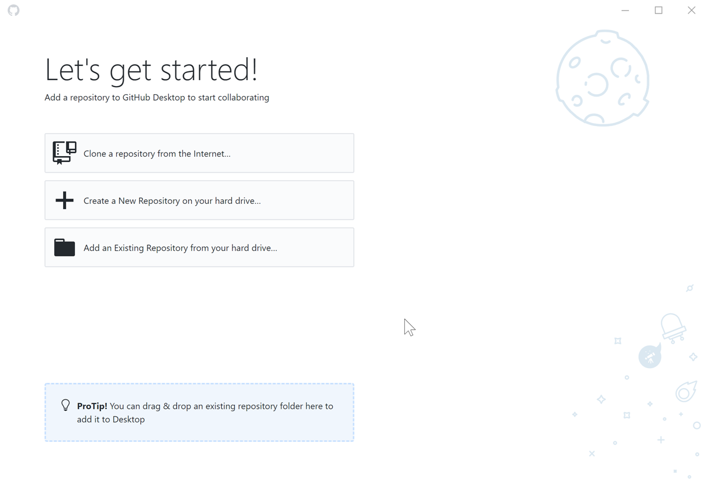

# Git and Github

## What is git?

Computer programmers almost always work in teams, often large ones. With many people working on the same files, it is important that they have a way to share work with each other that doesn't break anything and keep track of the work they are doing. They often need to keep track of multiple versions - some with features that are still being written, some without. A version that is ready to be used by all users, a version in beta. And so on. Something like Google Docs, but google docs themselves aren't well-suited to computer code for a variety of reasons. Instead, programmers use software called *version control software* to help them save, track, and share changes to their code.

The most famous example of version control software, and the most commonly used these days, is called *git*. We will practice using git in this course to save our work, keep track of our changes, and share our work with each other.

### Installing git

##### On your command line

```bash
#mac users do the below line
brew install git

#windows users do these two lines
choco install git
refreshenv
```

If that worked, you should be able to type `git --version` and get a response something like `git version 2.21.0.windows.1` 

`git` from the commandline is very cool, but needs more time than we will give it now; stay tuned for a lesson later!

## What is GitHub?

git itself runs only on your own computer, so when you use it to "save" a version of your work, you are only saving to your own personal computer. If you want to share your saves with other people, then you need to connect git to the internet and share it on a website. There are many sites that let you do that, and you can also run your own personal private ones.

[Github](https://github.com) is the most popular site on the internet for sharing code with other programmers using git. It is the website you are reading this on! We will be using Github to retrieve and work on assignments in this course.

### Signing up for GitHub

Open a new tab to [github](http://www.github.com) and click the "Sign Up" button in the upper righthand corner. Make an account. It is up to you which e-mail and username to use. PLEASE use your school e-mail and an appropriate username; if you want to create a personal account later you're welcome to, but for our class let's keep it classy. (hah)

### Installing Github Desktop

For new git and github users, it can be helpful to use a desktop program to interact with git, rather than relying on the command line. So let's install github desktop.

```bash
brew cask install github #mac users need only this line!

choco install github-desktop #windows users need only this line!
```

Once it is installed, you should be able to open the app. It will look like this:



You can close it for now. When the time comes, we will open it again and learn how to get it working!


----

[Return to Getting Set Up](01_Getting_Set_Up.md)