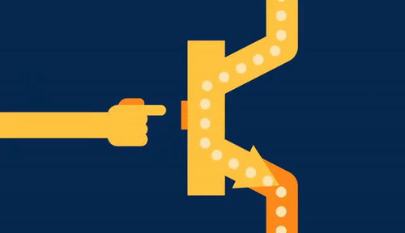

# What is a transistor?

A **transistor** is a tiny, *solid-state* electronic component that serves as the basis of modern electronic computing. Essentially, a transistor works as an electronic switch, as animated below:

In a transistor, however, you don't need to physically press a button to turn the switch off an on; instead, a tiny amount of electric current is applied to a special wired called the *base wire*, and that allows the current to flow across the other two wires.

The physics of transistors is very complex and relies on quantum mechanics and a special material called a **semiconductor**, which sometimes conducts electricity and sometimes doesn't! The most famous semiconductor is *silicon*, which is why we associate that material with electronics.

Modern technology has enabled us to fabricate transitors as small as a few nanometers in size, allowing us to fit billions of transistors on tiny pieces of material no larger than a coin. This is the basis of all modern computing.

## Calculation with transistors

At their most basic level, transistors can be combined together to create *logic gates*, which allow us to simulate [boolean logic](np2.9_boolean_logic.md). The embedded video below, from Crash Course computer science, contains information about boolean logic and also briefly explains how transistors can be used to create logic gates. The *details* of how transistors create logic gates is not part of the exam, but the abstraction of logic is!

<iframe width="560" height="315" src="https://www.youtube.com/embed/gI-qXk7XojA" title="YouTube video player" frameborder="0" allow="accelerometer; autoplay; clipboard-write; encrypted-media; gyroscope; picture-in-picture" allowfullscreen></iframe>

## Uses of transistors - the fundamental operations

By combining logic gates very cleverly, it is possible to build everything we use computers to do! At their most basic level, it is possible to build circuits that *calculate* as well as circuits that can *remember* data.

At the very least, every single computer has circuits taht allow it to perform the fundamental operations: **add** numbers together, **compare** two values, **store** values into memory for later, and **retrieve** values from memory. We will learn more details about these elements later on.