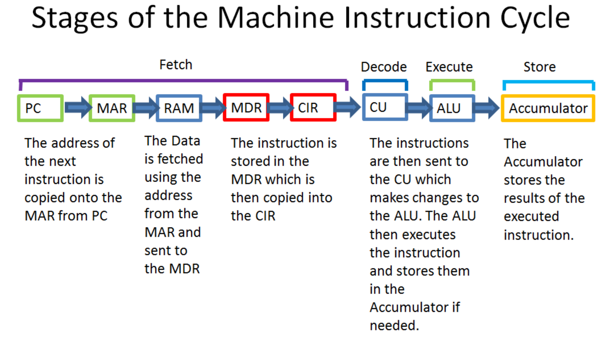

Before we begin, I'd like to give credit to the amazing resources at [IB Compscihub](https://ib.compscihub.net) for helping me a lot with this topic. Many of the explanations and images below are taken from their notes on topic 2.1.1, with some changes and reorganization.

# The Machine Instruction Cycle ([Topic 2.1.5](../resources/syllabus.md#215))

The basic role of a **CPU** (Central Processing Unit) is to run programs, a series of instructions. It does this by repeating a series of four steps, as described by IB CS teacher Matthew Ellard in the video below. Thanks Mr. Ellard!

<iframe width="560" height="315" src="https://www.youtube.com/embed/g85uW4F4aBo" frameborder="0" allow="accelerometer; autoplay; encrypted-media; gyroscope; picture-in-picture" allowfullscreen></iframe>

## A.K.A. the Fetch-Execute cycle

The machine instruction cycle is also called the fetch-execute cycle, because those are the key elements.

1. Fetch the next instruction from memory
2. Decode the instruction
3. Execute the instruction
4. Store the result back into memory
5. Repeat!

To get a deeper understanding of how the fetch-execute cycle works in a processor, we need to take a deeper look at the parts of the CPU and the other components it connects to.

# The CPU and Its Connections([Topic 2.1.1](../resources/syllabus.md#211))

In [Section 1.1](./np1.1_abstraction.md) we got an overview of the many layers of the computer processor, or CPU. The block diagram below shows more information about the key components in almost any general computer processor and its connections to the outside world. We will break down all of the components of this block diagram below the image.  This is not a complete diagram for every computer - many processors will have far more components than shown here, and some of these explanations are intentionally simplified - but it is enough to get the general idea (and as much as the IB wants you to know!). *Please Note:* The size of the components does not mean anything in the diagram below.

<small>**Important Exam Note** [Topic 2.1.1](../resources/syllabus.md#211) in the IB syllabus specifically states that you will need to be able to reproduce a diagram like the one above that includes the ALU, CU, MAR, MDR, Input, Output, Storage, and Memory at least. So this is a very important diagram!  
[Access this figure in Google Drawings](https://docs.google.com/drawings/d/1qLqcGdO5NJ3pptWbJyHte9x2EfpGBUCnR31RKaQwLFk/edit?usp=sharing)</small>
{: style="margin:0 3em 0 1em; border:.5px solid black; padding:2px"}

## Control Unit (CU)

The control unit, abbreviated CU, directs the flow of operations within the processor. It can communicate with all of the other components of the processor and computer and directs the action. It is responsible for decoding the commands sent to it and passing instructions along in the processor. This component is responsible for sending the "*Fetch* command, *decoding*the instruction, and sending commands on how to execute the instruction.

## Arithmetic Logic Unit (ALU) and Floating Processing Unit (FPU)

The ALU and FPU do all of the math that makes up the core of almost every computer program (whether you know it or not). ALUs are used to do math on integers, including addition, subtraction, multiplication, and comparison, as well as logical operations (which we will discuss later). FPUs are used to do math on decimals and numbers in scientific notation. There may be other special mathematics units as well in some processors, but these are the most common types. We will learn more about HOW the ALU does some of its math in a later unit. Most of the steps in the *Execute* section of they cycle happen here.

## Registers

In our previous section, we mentioned CPU registers as tiny memory circuits that live directly in the CPU to hold the data being used right *now* but the processor. There are three types of registers you should understand. *NOTE*: The IB exam explicitly states that only the MDR and MAR will be tested, but its hard to understand how processors work without thinking about all five register types below.

1. **General Purpose Registers**  
   Registers that can hold one piece of data, usually 32 or 64 bits in size, for a short amount of time as directed by a program directly. These are used to temporarily hold values until the ALU can get around to performing operations on them, usually for no more than a few millionths of a second.

2. **MAR - Memory Address Register**  
   These registers hold only one thing - an *address* in memory where a piece of data will either be retrieved or stored. An address is simply a number that tells the computer where to go in the memory to find a piece of data. The MAR doesn't ever hold the data itself, only the location where it will be found!

3. **MDR - Memory Data Register**  
   These registers hold the actual data pulled from memory or that will soon be put back into memory at the spot stored in the MAR. Combined with the MAR, they work as a *buffer*, a temporary storage place for data between the memory and the processor; this is necessary to make it possible for the memory and processor to work somewhat independently.

4. **CIR - Current Instruction Register**
   This register holds the data needed for the current instruction. It is copied from the MDR at the appropriate time.

5. **The Accumulator**
   This register holds the result of the current operation in the ALU until is told where to put it (another register, or in the MDR to go to memory)

### Cache and RAM

These were already addressed a bit in [Section 1.2](./np1.2_memory.md). All of the data that will be used by the processor during its operation, including the instructions for the program currently being run, are stored in the primary memory, a.k.a. the cache and RAM combo.

## Buses

A *bus* is a dedicated physical connection inside a computer whose purpose is to carry data very quickly between components of a computer, with as few separate wires as possible. Think of it like a highway traveled by buses that can drop passengers (data) off at any of several separate stops. The data bus, address bus, control bus, and I/O bus carry information between the important elements of the computer as shown. The data bus carries data, the address bus carries information about where the data should be stored, and the control bus carries information about *how*, *when*, and *where* to move the data. The I/O bus carries information from input and output devices, after passing through a standalond separate chip called the I/O chip.

# Machine Instruction Cycle (part 2)

Now that we have seen the parts of a CPU, we can better understand how the machine instruction cycle works at a lower level (less abstract!)

The image below comes from [IB CompSciHub](https://ib.compscihub.net/wp-content/uploads/2018/06/2.1.4.pdf)

This diagram stops once the instruction is finished, but the next steps should make sense - often, the "Fetch" cycle will be done again but in reverse to store the result into RAM, then the next instruction will be fetched, continuing the process.

# Study materials

## Check your Understanding

1. **(May 2018, paper 1, question 2)** Outline the role of the memory data register in the machine execution cycle
  
   

Click to expand official IB markscheme

   Holds (a copy of) the contents of the memory;  
   Which are transferred from/to the memory to other CPU components;  
   Allowing the processor and memory to act independently / processor not affected by differences in the speed of the operation / allows for a buffer;  
   **(Award 1 mark for each of the correct elements above, max 2 marks)**  
     
   **Note**: The word "outline" in IB questions means you need to describe several steps - dont be too short!

   

2.  **(May 2019, paper 1, question 7)** Outline the purpose of the memory address register (MAR) in the central processing unit (CPU)
      
    

Click to expand official IB markscheme

    *Award [2 max].*   
    The MAR holds the memory location of data/instructions;  
    …that need to be accessed (read/write) (fetch/store);  
    

3.  **(November 2017, paper 1, question 8)**  The machine instruction cycle is the process by which a program instruction is fetched, decoded, executed and the results are stored.
   
    1. State where all instructions and data are stored. [1 mark]
   
    2. Outline the role of the data bus and address bus in this process. [2 marks]
   
    

Click to expand official IB markscheme

    1. Primary memory / RAM  
        *note*: the word "state" or "identify" is clue that this is a very short answer question! Also, I expect 'registers' would be accepted here, even though they are stored for a longer time in the RAM.
   
    2.  Award up to [2 max].
        Note: there must be explicit reference to both address and data bus

        **Example 1**  
        Buses are used as physical connections to carry information to the CPU;
        The data bus transports data from/to CPU, whereas the address bus the memory
        address where the data is supposed to go/be.

        **Example 2**  
        Data bus is a physical connection to transport data from-to CPU to be
        processed;  
        Address bus is a physical connection to transport an address of memory storage where data
        (transported in the data bus) should be read/written;  

        Note: Award [1] mark, for responses that show some understanding of use of
        buses in CPU, for address location and data transport without using specialist
        terminology
    

4.  **(May 2019, problem 8)** State the part of the central processing unit (CPU) that is responsible for carrying out 
calculations.

    

Click to expand the official IB markscheme

    Arithmetic and Logic Unit or ALU (1 mark)
    

## Terms

Note that some of these may be repeated - that's okay! Make flashcards for any you don't have, or add any new infromation to flashcards you already have.

* Central Processing Unit (CPU)
* Control Unit (CU)
* Arithmetic Logic Unit (ALU)
* Floating Point Unit (FPU)
* register
* data bus
* MAR (Memory Address Register)
* MDR (Memory Data Register)
* address bus
* machine instruction cycle

## External Resources

* [Summary video from IB CompsciHub](https://www.youtube.com/watch?v=bI9NRh9BnxY)

* [IB CompSciHub notes Topic 2](https://ib.compscihub.net/paper-1/topic-2) - Look at the linked PDF notes from 2.1.1 and 2.1.4 for notes related to this page.

* [Mr. Wachs Workbook - Computer Organization](https://drive.google.com/file/d/1YLGWShcZZNXQWOYYcuGRUxZ-EAc3xF3F/view?usp=sharing) - These very comprehensive notes by computer science teacher [Mr. Wachs](https://mrwachs.wordpress.com/current-classes/computer-science-i-b/) include notes on all of Topic 2. He includes some information that I don't think is necessary, but its an interesting and complete read.
  
* [Mr. Wachs Videos](https://www.youtube.com/playlist?list=PLZbVESc4rBHlBi2gwdlppxQJX4EOmsSxx) - Discussion of computers and the computer processor take up most of the first video and part of the second one in the Computer Organization topic. He goes into a lot of detail in the video, just like in the notes, probably more than you need to know.

* [Paul Baumgarten's Topic 2 Notes](https://pbaumgarten.com/ib-compsci/unit-2/unit-2-computer-architecture.pdf) - The Memory topic is part 5 of these notes, a little more than halfway down.