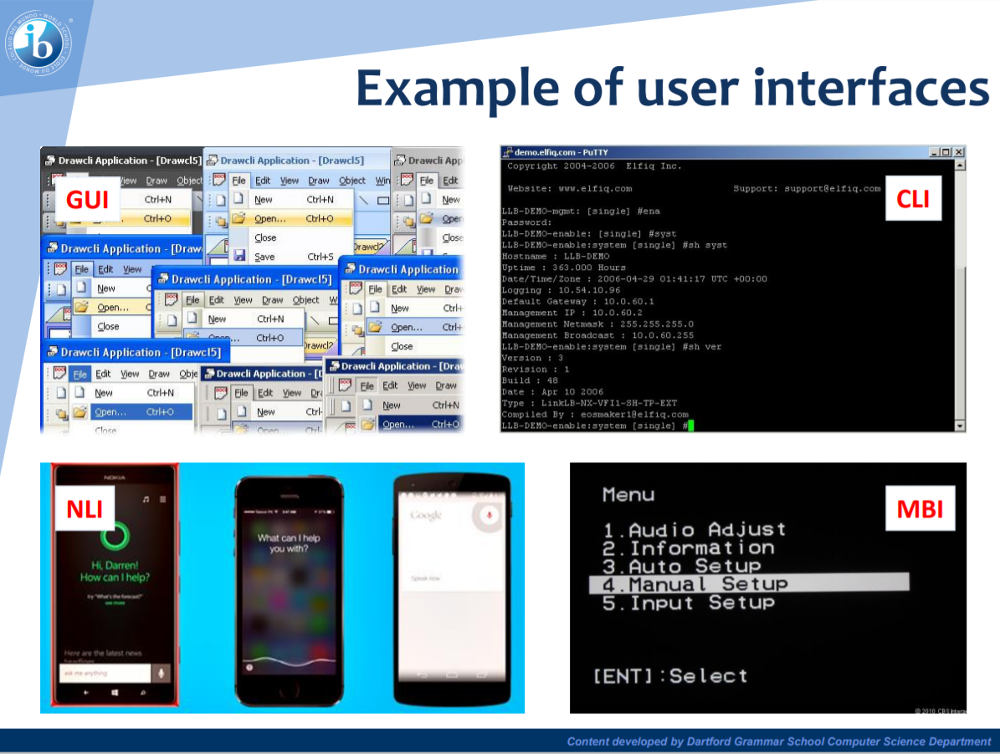
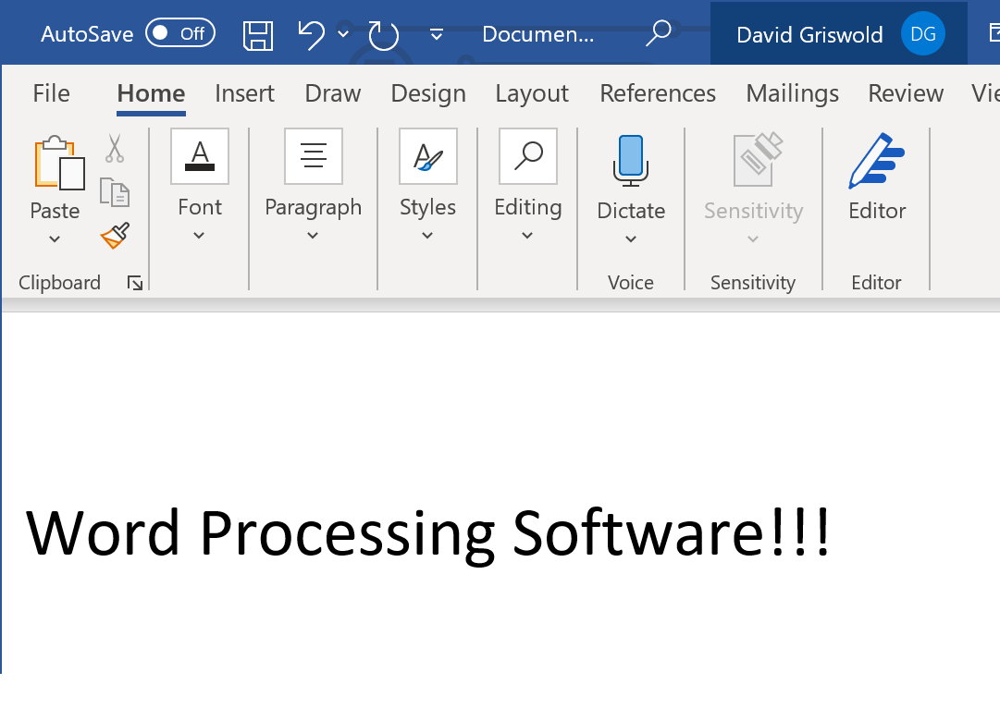

# Programs and Software

In the previous lesson, we learned a bit about how a computer processor uses the Machine Instruction Cycle to execute a series of instructions. We call a connected group of CPU instructions a **computer program** or piece of **software**:star:. 

## Programming Languages and Compilers

It is interesting to think about HOW a piece of software is written. We touched on this in our initial page of notes, but lets look in a little more detail.

### High Level Programming Languages

Most computer software is written by humans, using a **high-level programming language**:star: - like Java! - that lets the human write software in a way that makes sense to them.<small>[4.3.4](../resources/syllabus.md#434)</small> High level programming languages can look very different from each other, but they all have a few key features in common.<small>[4.3.3](../resources/syllabus.md#433)</small>, including:

* A predictable *vocabulary* of key words and symbols that have meaning within the language
* A consistent *grammar* for how instructions are entered and separated with symbols
* A consistent *syntax* for the order of vocabulary and grammar to make sense

The goal of these features is to make sure that every computer program has an **unambiguous meaning** - it is really important there can only be one possible interpretation of a computer program, because computers aren't smart!

### Compilers and Interpreters

 
<small>Image credit: [GeeksForGeeks](https://www.geeksforgeeks.org/intermediate-code-generation-in-compiler-design/)</small>
{: .image-right style="margin-left: 1rem; border:.5px solid black;"}

When a human writes a computer program in a high-level language, they have made something thats easy for HUMANS to read, but it is not written for computer processors. Before the software can be run, it needs to be *translated* into a series of instructions (fundamental operations!) that the processor can actually be understand.

A **compiler**:star:<small>[4.3.5](../resources/syllabus.md#435)</small> is a special piece of software that takes code written in a high-level language and converts it to the machine code that the computer can read, with the goal of making the machine code as efficient as possible. A compiler will go through five important steps.<small>[4.3.5](../resources/syllabus.md#435)</small>

1. It *pre-processes* the program, which allows it to replace some elements with more efficient (but less readable) code. For example, if you have a constant in your code like `final int PI=3.14`, the pre-processing step will replace the word PI with the actual value 3.14 everywhere in the code. 
   
2. It performs *lexical analysis* to convert the characters in the actual programs to special internal *tokens* that have meaning to the processor.
   
3. It *parses* the symbols created in lexical analysis step and builds an internal structure showing how the symbols are related to each other, which helps the compiler understand the structure of the program. 
   
4. It *optimizes* the code by finding places in the parsed program that can be sped up or made to take up less memory.
   
5. Finally, it translates the parsed and optimized code into machine instructions.

Some programming languages, such as Java and C, have separate compilers that translate source code into object code, which can then be distributed separately. Other programming languages, like javascript and python, can use an **interpreter**, which is essentially a compiler that runs on the fly and creates object code from source code *as the program runs*. Advantages of compiled languages include being more efficient and faster to run and being able to distribute software without the source code, while advantages of interpreted langugages include speed of writing code, flexibility, and ease of distribution.

## The Operating System (OS)

One of the most important pieces of software run on any computer is the **operating system**:star:<small>[2.1.6](../resources/syllabus.md#216)</small>. The operating system provides an environment for all of the user-facing application software on a computer to run inside, and manages all of the important resources in a computer. 

Commonly used operating systems you might have encountered include Mac OS X, Microsoft Windows, iOS, WatchOS (apple), Android, Android Wear, ChromeOS, FitbitOS, Tizen, Unix, Linux, Alexa, Google Assistant, and so on.

### Key Roles of an OS

  
<small>Image Credit: [IB Compsci Hub](https://ib.compscihub.net/wp-content/uploads/2018/06/2.1.6.pdf)</small>
{: .image-right style="width:50%"}

* Provides a **user interface**:star: for the user of the computer - modern ones would include elements such as application icons, windows, consistent buttons, menus, notifications, and so on. These are called **Graphical User Interfaces**. Simpler or older operating systems may only provide a *command line interface*, where the user types commands into a screen, or a *menu-based interface* for selecting from a menu, while some OSes even provide a *natural language interface* for talking to the device.
  
* Does **memory management**:star:, meaning it figures out how to alot the space in **RAM** and **cache** to the various other pieces of software running on the machine. This is called **allocation**:star: Once a program is through with the memory blocks, it will become available and the OS will offer it to other programs. The operating system will also manage any **virtual memory** on the computer. (see [NP1.2](np1.2_memory.md) to remember more about these memory types).

* Keeps track of secondary storage, and provides tools to manage where files and information are saved in secondary storage.
  
* It manages the **peripherals** connected to the computer, including listening to inputs from peripherals such as mice and keybards, and sending output information to devices like screens and speakers. These peripherals are managed through the help of small pieces of utility software called **device drivers** that translate the information from the peripheral into something the OS can understand.
  
* It allows for **multi-tasking**, running several different programs at once, and it manages the process of sending their code to the CPU in the proper order, based on the priority of the various tasks.

* It provides **security features** to help the user keep their software and data safe.

## Application Software

Most of the software that a user interacts with on a traditional computer can is called **application software**:star: - these are the "Apps" or "Programs" you install on your computer or phone and run or switch between.<small>[2.1.7](../resources/syllabus.md#217)</small> Some common types of application software include:

{: .image-right style="width: 40%; border: 1px solid black;"}

* **Word Processors** are designed to help the user write and format text information for a printed page, including very long text documents.
  
  Examples include Google Docs, Microsoft Word, or Apple Pages
  {: .clearfix}
  

{: .image-right style="width:40%; border: 1px solid black;"}

* **Spreadsheets** are programs designed to help users work with data, mostly numeric data, organized in tables. They provide many calculation tools that allow the user to do complex calculations, analysis, and work on the data internally within the sheet.
  
  Examples include Google Sheets, Microsoft Excel, and Apple Numbers.
  {: .clearfix}

* **Presentation software** is used to make presentations to present data to people. Examples include Google Slides, Microsoft Powerpoint, and Apple Keynote.
  
* **Database management systems** are tools used to sort, organize, and work with large amounts of interconnected data. Examples included Microsoft Access, MySQL (pronounced "my sequel"), and MongoDB
  
* **Web Browsers** are used to navigate to websites on the world wide web - and these days, web browsers almost function as small operating systems themselves, with other applications running inside of them! Examples include Google Chrome, Apple Safari, Mozilla Firefox, and Microsoft Edge.
  
* **Computer-Aided Design** software (or CAD) is used to create very accurate models of 2d or 3d objects. This software is commonly used by product designers, engineers, and architects to visualize their real-world projects before they actually make them. Examples include AutoCAD, TinkerCAD, and Solidworks.
  
* **Page Design** software is somewhere between CAD software and Word Processors. It is used to more carefully design and lay out informatin that will appear on a printed page. Examples included Adobe Indesign and Microsoft Publisher.
  
* **Graphics Processing Software** is used to work with graphics and images. Examples included Adobe Photoshop, Paint Shop Pro, and The Gimp

* **Communication software** is used to aid with communication with other people. Examples include e-mail programs like Microsoft Mail or Gmail, and instant messaging software like WhatsApp or Discord.

All of these types of software, as well as other software you might install, should include some common features such as windows, toolbars, menus, and so on, as defined by the OS and implemented by the application software itself.<small>[2.1.8](../resources/syllabus.md#218)</small>

#### Check Your Understanding

1. One of the things a compiler does is translate source code to byte code. Name two other things done by a compiler. (IB )

2. Identify two types of general application software that might be installed on office computers. (IB SL May 2019 #15c)
   
   

Show official IB markscheme

   Examples might include: web browser; word processor software; spreadsheet software; database management software; e-mail client

   Award 1 mark for each reasonable category, up to [2] marks. Award NO marks for specific software title (e.g. Microsoft Word or Google Chrome)
   

3. Outline the role of the operating system in managing primary memory (IB SL Nov 2018 #8aii)

   

Show official IB markscheme

   Award [1] for the answer saying that the function of OS in primary memory management is allocation of specific memory blocks to individual programs and [1] for reallocation up to [2 max].

   Example answer:  
   A part of the OS (memory manager) assigns that block of memory to the program when a running program requests a block of memory; When the program no longer needs the data in previously allocated memory blocks, they become available for reassignment;
   

