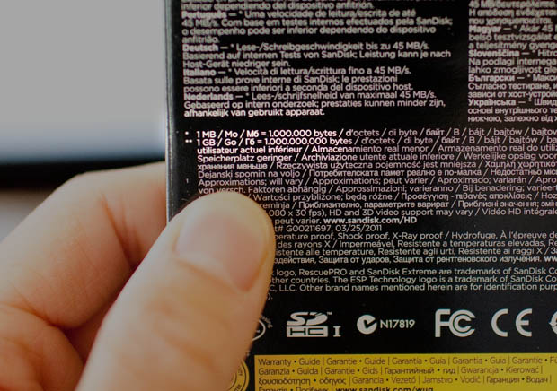

# Binary and Hexadecimal

As we have seen before, all data on computers is stored as a series of *bits* - tiny pieces of information that are either on or off, with no region in between.

Because our brain works best using letters or numbers, it is easiest to think of these bits as either having the values **`T`** and **`F`**,  or **`0`** and **`1`**. The second is more common.

Working with only two digits, `0` and `1`, creates an entirely new number system called **binary**:star:. You can think of binary as being a system for an alien race that only has 1 finger on each hand, so they only ever created two digits! The system we normally use, with 10 digits, is called the **decimal**:star: system.

Because only having two options for any particular piece of data is USUALLY not enough, we often want to work with larger groups of bits, to give us the possibility of representing bigger numbers.

## Numbers in 4 bits - the nibble

A **nibble** consists of four bits taken together as a single chunk. If we read data in as nibbles, then each nibble can stand for any number between 0 and 15, as shown below. 

| Decimal | Binary |     | Decimal | Binary |
| ------- | ------ | --- | ------- | ------ |
| 0       | 0000   |     | 8       | 1000   |
| 1       | 0001   |     | 9       | 1001   |
| 2       | 0010   |     | 11      | 1010   |
| 3       | 0011   |     | 10      | 1011   |
| 4       | 0100   |     | 12      | 1100   |
| 5       | 0101   |     | 13      | 1101   |
| 6       | 0110   |     | 14      | 1110   |
| 7       | 0111   |     | 15      | 1111   |

The image below demonstrates how we count in binary AND decimal - it actually works just like counting in regular numbers, its just that we can only alternate between 0's and 1's in each spot, rather than counting all the way up to 9 in each spot!

### Converting between Binary and Decimal 

Let's consider one of the number combinations above:

**14 (decimal) ≡ 1110 (binary)**
{: .giantText .center}

To understand why these two numbers are the same, you have to think about what the 1 and the 4 actually mean - place value!

**14** = **1** Ten + **4** Ones
{: .giantText .center}

In binary, because there are only TWO possibilities for each digit instead of 10, the place values aren't about 10s - they are about 2's! Specifically, POWERS of two.

**1110** = **1** eight (23) + **1** four (22)  
+ **1** two (21) + **0** ones (20)

This, of course, is equivalent to 14 in decimal, as we already saw. You could convert the other way by working backwards and finding powers of two that can be added to get your number.

#### Check Your Understanding

1. Convert the 6-bit binary number `10 1101` to decimal.
   

Click to show answer

   $$2^0 + 2^2 + 2^3 + 2^5 = 1 + 4 + 8 + 32 = 45$$
   

2. Convert the decimal value 55 to binary
   

Click to show answer

   Write 55 as a sum of powers of 2  
   $$55 = 32 + 16 + 4 + 2 + 1 = 2^5 + 2^4 + 2^2 + 2^1 + 2^0$$   
   So in binary, we would write this as `11 0111`
   

   
#### Test Yourself

Use the little boxes below to test yourself.

<label for="binaryInput">Binary </label>
<input type="text" id="binaryInput" oninput="validateBinary(event)">
<button id="bToD" onclick="bToD()">---></button>
<button id="dToB" onclick="dToB()"><---</button>
<input type="text" id="decimalInput" oninput="validateDecimal(event)">
<label for="binaryInput">Decimal</label>

If you want more information about converting to and from decimal and binary, I suggest using [Khan Academy's article](https://www.khanacademy.org/computing/ap-computer-science-principles/computers-101/digital-data-representation/a/bits-and-binary) and [practice problems](https://www.khanacademy.org/computing/ap-computer-science-principles/computers-101/digital-data-representation/e/bits-and-binary-exercise) to help you understand more completely.

### Hexadecimal digits

{: .image-right style="width:20em"}

It turns out, however, that our normal decimal numbers are a pretty bad way to work with nibbles (and, later, bytes) because the conversion between the two is never pretty. This is because the CARRYOVER vale in decimal (10) does not match up with a carryover value in binary, so things don't line up nicely.

To get around this, computer scientists often work with nibbles using a system called **hexadecimal**. In this world, we imagine that we actually have MORE digits - 16 of them - rather than fewer. To make this work, we add the digits `A B C D E F` to our normal `0 - 9` to get a total of 16 digits, with A representing 10 up through F representing 15.

In this case, our table of nibbles simply looks like this:

| decimal | binary | hexadecimal | --- | decimal | binary | hexadecimal |
| ------- | ------ | ----------- | --- | ------- | ------ | ----------- |
| 0       | 0000   | 0           |     | 8       | 1000   | 8           |
| 1       | 0001   | 1           |     | 9       | 1001   | 9           |
| 2       | 0010   | 2           |     | 10      | 1010   | A           |
| 3       | 0011   | 3           |     | 11      | 1011   | B           |
| 4       | 0100   | 4           |     | 12      | 1100   | C           |
| 5       | 0101   | 5           |     | 13      | 1101   | D           |
| 6       | 0110   | 6           |     | 14      | 1110   | E           |
| 7       | 0111   | 7           |     | 15      | 1111   | F           |

Working in hexadecimal allows us to directly convert a single nibble (a very common chunk of data) into a single "digit" that takes up much less space on paper (and might be easier to read), but without any of the annoying mathematical calculations of moving back and forth to decimal. This makes it much easier to work with larger chunks of data, like bytes.

## Working with bytes (8 bits)

A **byte** consists of 8 bits, or 2 nibbles. Because each nibble can take any of 16 possible values, there are $$ 16 \cdot 16 = 256 $$ possible values for a single byte - enough that we're starting to get interesting!

We will not list every possible byte, but consider an example: `1101 0011` (it is common to write bytes with a space between the nibbles, for readability). If I wanted to convert this into a SINGLE decimal value, I coud use place value: $$ 2^7 + 2^6 + 2^4 + 2^1 + 2^0 $$ $$ = 128 + 64 + 16 + 2 + 1 $$ $$ = 211 $$. This is a LOT of work though!

We could also represent this byte in hexadecimal. Because hexadecimal has a direct connection to nibbles, I can just convert each nibble INDEPENDENTLY! Starting with the first nibble: 

**1101** (bin) ≡ **13** (dec) ≡ **D** (hex)
{: .giantText .center}

Then the second nibble:

**0011** (bin) ≡ **3** (dec) ≡ **3** (hex)
{: .giantText .center}

So therefore we have

**1101 0011** (bin) ≡ **D3** (hex)
{: .giantText .center}

We could confirm that this is the same value by converting the new hexadecimal value back into decimal. To do this, we need to realize that hexadecimal uses powers of 16, so we would have **D3** = $$13 \cdot 16^1 + 3 \cdot 16^0 = 208 + 1 = 211$$ . This tracks with our work earlier, and lets us see the very important result:

**A single byte represents 8 bits, so it can always be represented by exactly 2 hexadecimal digits**
{: .largeText}

### Check Your Understanding

1. Convert the binary value `0101 1110` to hexadecimal. (IB November 2018 SL problem 8ci)
   

Click to expand answer

   Working one nibble at a time:  
   `0101` is equivalent to 1 + 4 = 5 in decimal, so it is 5 in hexadecimal.  
   `1110` is equivalent to 8 + 4 + 2 = 14 in decimal, so it is E in hexadecimal.  
   Thus, the total value here is `5E` in hexadecimal.

   The IB would award only one mark for this, for the correct answser, no partial credit.
   

2. Convert the binary value `1101 0101 0000 1011` to hexadecimal
   

Click to expand answer

   Working one nibble at a time:  
   `1101` is equivalent to 8 + 4 + 1 = 13 in decimal, which is D in hexadecimal.  
   `0101` is equivalent to 4 + 1 = 5 in decimal, so it is 5 in hexadecimal.  
   `0000` is 0 in everything including hexadecimal.  
   `1011` is 8 + 2 + 1 = 11 = B in hexadecimal.  
   Thus, the total value here is `D5 0B`
   

3. Convert the hexadecimal value `A5` to binary and decimal
   

Click to expand answer

   Working one nibble at a time (for binary conversion): 
   `A` is 10 in decimal, which is 8 + 2 in binary, so that is `1010`  
   `5` is 5 in decimal too, which is 4 + 1 = `0101` in binary  
   So the total value here is `1010 0101`  

   For the decimal conversion, we use powers of 16.  
   $$10 \cdot 16^1 + 5 \cdot 10^0 = 160 + 5 = 165$$ in decimal.
   

#### Test Yourself

Use the little boxes below to test yourself.

<label for="binaryInput2">Binary </label>
<input type="text" id="binaryInput2" oninput="validateBinary(event)">
<button id="bToH" onclick="bToH()">---></button>
<button id="hToB" onclick="hToB()"><---</button>
<input type="text" id="hexInput" oninput="validateHex(event)">
<label for="hexInput">Hexadecimal</label>

<label for="decimalInput2">Decimal </label>
<input type="text" id="decimalInput2" oninput="validateDecimal(event)">
<button id="dToH" onclick="dToH()">---></button>
<button id="hToD" onclick="hToD()"><---</button>
<input type="text" id="hexInput2" oninput="validateHex(event)">
<label for="hexInput2">Hexadecimal</label> 

   
If you want to read more about hexadecimal, and do some practice conversions, [khan academy](https://www.khanacademy.org/computing/ap-computer-science-principles/computers-101/digital-data-representation/a/hexadecimal-numbers) is still your friend.

# Calculating the possibilities for given space

To find the total number of values that can be stored in $$n$$ bits, use the calculation $$2^n$$. 

So in a byte, we can fit up to $$2^8 = 256$$ possible values. If we are storing integers as shown above, those will be the values from 0 to 255 (`0000 0000` to `1111 1111`, or, in hexadecimal, `00` to `FF`). But as we will see, we can use binary to represent all sorts of things, from letters to colors to sounds, and no matter what you are representing, if you read one byte you get 256 options for that byte!

In java, an `int` variable actually uses FOUR bytes, or 32 bits, of space. That means it can hold $$2^{32} = 4,294,967,296$$ possible values! You could also calculate this with $$256^4$$ since each byte holds 256 options, and there are 4 bytes. And a `double` in java uses EIGHT bytes, 64 bits - That means it can hold $$2^{64} = 256^8$$ possible numbers, a whopping 18 QUINTILLION different values!

You will not have a calculator available on IB tests, so for problems like this you would generally expected to leave answers as an unworked calculation, such as $$2^{64}$$.

### Check your undersanding

1. State how many different integers can be represented in a single byte (November 2018 SL Problem 8cii)
   

Click to expand answer

   $$2^{8}$$ or $$256$$
   

2. How many different colours can be represented using two hexadecimal characters? (May 2018 SL Problem 3)
   

Click to expand answer

   Each hex character can have up to sixteen options so one way to represent this is $$16^2=256$$

   Alternatively, if you remember 2 hex characters is one byte, this is $$2^8=256$$
   (IB mark for $$16^2$$, $$2^8$$, or $$256$$)
   

3. How many different values can be stored in 3 bytes? (leave your answer as an unworked value)
   

Click to expand answer

   $$2^{24}$$ or $$256^3$$
   

4. Web browsers represent colors using 4 bytes. How many different colors can be represented using four bytes? (leave your answer as an unworked value)
   

Click to expand answer

   $$2^{32}$$ or $$256^4$$ (this equals about 4 billion colors!)
   

5. The Unicode standard uses 21 bits to hold different characters. How many possible characters can be encoded using 21 bits?
   

Click to expand answer

   $$2^{21}$$
   

   
# Larger Sizes

It is very common to consider thousands, millions, or billions of bytes at a time. For this reason, computers use a modified metric system to refer to really large numbers of bytes.

The metric system, of course, is based on powers of 10: one kilogram is 1,000 grams, one megameter is 1,000,000 meters, etc. But with computers, the powers of ten don't make as much sense.

Therefore, all storage prefixes in computers are based not on 10, but on $$2^{10} = 1024$$

**1 Kilobyte (KB) = $$2^{10}$$ = 1024 bytes**

**1 Megabyte (MB) = $$2^{20} = 1024^2$$ = 1,048,576 bytes**

**1 Gigabyte (GB) = $$2^{30} = 1024^3$$ = 1,073,741,824 bytes**

**1 Terabyte (TB) = $$2^{40} = 1024^4$$ = 1,099,511,627,776 bytes**

Despite this definition, you will occasionally see manufacturers use the real metric system (1 GB = 1 billion bytes) when describing their products, as seen below. This is solely so they can advertise more space than the product actually holds! A 1TB hard drive SHOULD hold 1.1 trillion bytes, but will usually hold only 1 trillion, 10% less!

<small>Image Credit: [The Dream Within Pictures](http://thedreamwithinpictures.com/blog/why-hard-drives-and-memory-cards-have-less-space-than-advertised)</small>

### Check your undersanding

1. How many bytes are in 2KB? 
   

Click to expand answer

   $$1024 \cdot 2 = 2048$$
   

2. How many bytes are in 5MB? (leave your answer as an unworked value)
   

Click to expand answer

   $$5 \cdot 2^{20}$$ or  $$5 \cdot 1024^2$$
   

3. If a character in UTF-16 takes two bytes on average, about how many characters can fit on a 300GB hard drive? (leave your answer as an unworked calculation)
   

Click to expand answer

   $$150 \cdot 2^{30}$$ or $$300 \cdot 2^{29}$$ (or any equivalent answer)
   

