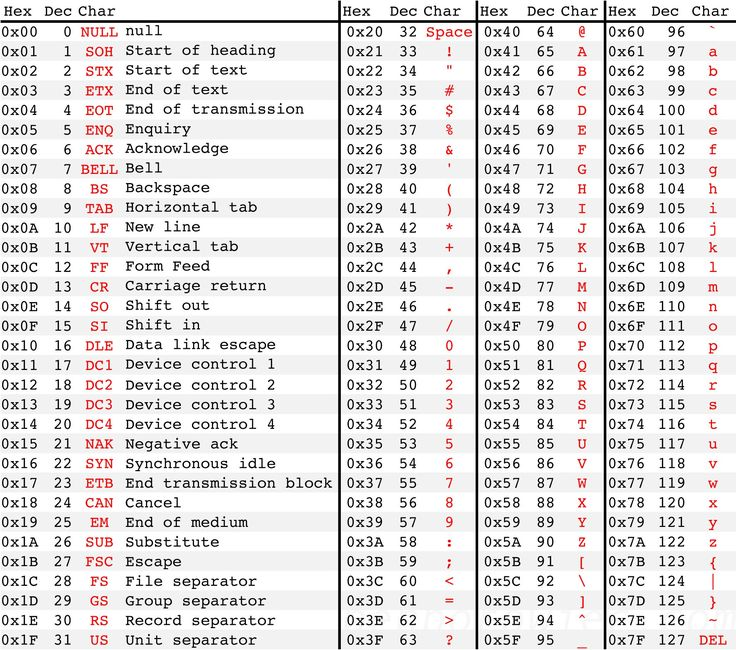

# Representing Characters

In [Lesson 2.5](np2.5_representing_integers.md) we learned how we can think of the 0's and 1's inside of a computer as other numbers, in either decimal or hexadecimal. But we often want to store other things than just nonnegative numbers!

If we want to represent other things, we need to come up with an **encoding scheme**:star: - an agreed-upon way of storing the information we care about using nothing but bits. As long as the person or program STORING the data and the person or program READING the data both agree on the encoding scheme, then the information can be stored.

One very important thing to encode in computers is *text*, which is encoded in your computer as a series of **characters**, like the `char` variables in java.

The simplest way to think about storing characters is to imagine a *lookup table* of characters - basically a list of all the characters you want on one side, and a number (in hexadecimal!) that corresponds to that character. We call this a **character set**:star: and the history of character sets is fascinating.

## The original character set - ASCII

Traditional, older computers from the 20th century almost all used a character set called ASCII, short for American Standard Code for Information Exchange. This table only included 128 characters, so it required a mere 7 bits of data for each character! The image below shows the full table, and as you can see it includes every character on the US English keyboard, as well as my special characters that were used to give instructions to older printers and screens. (**Note:** in the image, the `0x` in front of each hex value is simply a shorthand often used to indicate the value is in hexadecimal)

;

## ASCII Extensions

Characters were traditionally represented using a single byte, which offers $$2^8 = 256$$ options. ASCII only needed 128, so the other 128 options were often used for ASCII *extensions*. These extensions varied depending on need - for example, the *Latin extended* variation added characters such as `à` and `ã` that would be needed for other latin-based languages. But other extensions added Germanic characters like `ü` or Arabic characters like `ﺖ` . Because different people across the world needed different extensions, the computer software reading it had to know which extension was used in order to read and display the files correctly.

This was still insufficient for languages such as Japanese or Korean, which have thousands of characters, and they had to use complex customized solutions for years. This made it very challenging to pass text information between people from different countries successfully.

## Unicode

Finally, in the 1990s, organizations from all over the world got together to create a standard *character set* that would connect a valid hexadecimal value to every single character used by every language, modern and ancient, and with room to spare for convenience characters and future characters as well.

After several years of work and tweaking, what emerged was the Unicode standard. This standard uses up to 21 bits to represent characters, which means it could represent over 2 MILLION different characters. So far, only 120,000 characters have been assigned, so there's lots of room to grow still! 

The worldwide acceptance of unicode has meant that any computer can read and write characters as diverse as `a` (Latin 'a'), `🐱‍👤` (ninja emoji), `ה` (Hebrew 'he'), `∰` (volume integral symbol), `갦` (Korean, or hangul, 'Gaelm'), and `𓀤` (Egyptian heiroglyph). Feel free to explore the unicode character set at [Unicode Table](https://unicode-table.com/en/) - it's very cool!

The adoption of unicode was slow, and still has the challenge that there are at least two possible ways to actually *encode* the unicode values. 

1. In **UTF-16** *almost* every character takes up 2 bytes, though a few of the special ones (like many of the emoji) take 4.  
   * **Advantages**: Since the vast majority of characters are the same size, it doesn't take much 'thinking' on the part of a computer to interpret the data. Programming languages like java can use 2 bytes to store `char` variables and they will usually be able to hold the complete character in that space. The two-byte characters in UTF-16 are also very easy to convert, even by hand, since they simply store the unicode hex value directly.
  
   * **Disadvantages**: Every single character takes at least 2 bytes, even the most common ASCII characters, which can make for very inefficient space usage. This is especially true in situations like computer code, which is written almost entirely using ASCII characters. This also means that files saved in UTF-16 are not backwards compatible with any older character systems. And because many of the use-cases of UTF-16 tend to assume everything is 2 bytes, the special 4-byte characters can provide difficulties or confusions even when they are correctly encoded.
  
2. In **UTF-8**, characters can take up different amounts of space, anywhere from 1 up to 4 bytes - the first bit(s) of each byte essentially tell the computer whether it needs to pull in more bytes to get the entire character.
   * **Advantages**: UTF-8 is completely compatible with ASCII. This means that any old file written in ASCII is a completely valid UTF-8 file, because those 128 characters only take one byte in UTF-8. This is a huge advantage on the web, because all of the code that makes a website uses ASCII characters, even if the content does not. This means that many UTF-8 files, especially those written in English, will be significantly smaller in UTF-8 than in UTF-16.

   * **Disadvantages**: The biggest disadvantage is that the more complex encoding scheme means the processor has to work harder to decode the files. It is also not an appropriate scheme for primitive data types in programming languages like java, since characters can range from 1-4 bytes with little expectation that most would be 2 bytes like in UTF-16. The complexity of the encoding scheme also makes it harder to write your own code to interpret the data, or interpret it by hand (rare though that need is).

### Check Your Understanding

1. In UTF-16, most characters are represented using 16 bits. How many possible characters can be represented using only those 16 bits?
   

Click to expand answer

   $$2^16$$, $$256^2$$, or 16,536 will all get credit
   

2. (IB Paper 18 Problem 8c SL) Outline why a single byte cannot be used to represent character in a language such as Chinese.
   

Click to expand IB markscheme

   Award **[1]** for identifying why this byte could not be used to represent characters such as those in Chinese and **[1]** for an expansion up to **[2 max]**.
   
   The characters must be represented as numbers so that computer can deal with them;  
   One byte (gives us the ability to represent only 256 characters) is enough to hold every possible character in a language which uses a limited set of text symbols, punctuation marks and special characters (for example, English, Spanish, etc);  
   Chinese exceeds the 256 character limit and therefore requires more bytes to represent all of the characters in this language;
   

The video below is optional, but if you find this stuff at all interesting it can be cool to see. In it, I explore the text string `Hi João! 👋` in several different character encoding schemes, and show what would happen if you try to open it in the WRONG scheme.

<iframe width="100%" src="https://www.youtube.com/embed/jLtV3j9j3ls" frameborder="0" allow="accelerometer; autoplay; encrypted-media; gyroscope; picture-in-picture" allowfullscreen></iframe>

