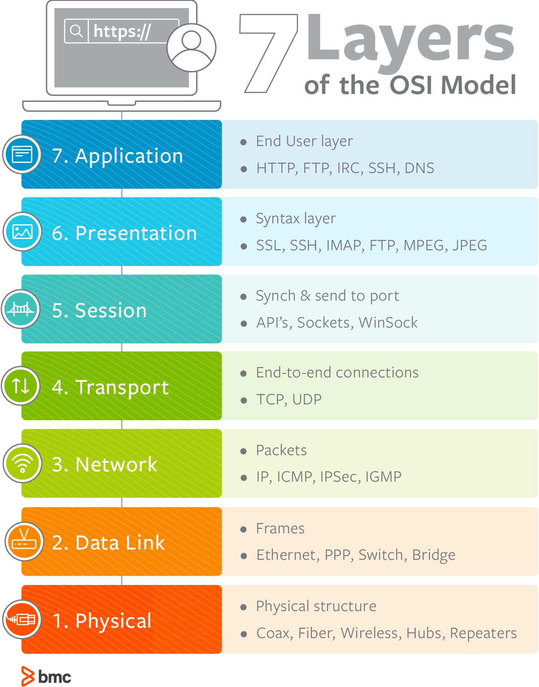

# Layers of a Network - the OSI Model

Way back in lesson [2.1](np2.1_abstraction.md) we talked about the concept of **abstraction**, which is a method of managing complexity in a system by breaking up our understanding into various levels that can be treated separately from each other; for example, to program in javascript you do not need to understand the details of how a computer processor works, because javascript and the computer processor are at different levels of abstraction.

In computer networking, there is a very popular model for the various layers of abstraction in how information is shared over networks. This model is called the **OSI Model for Network Layers** and it basically looks like this:

{: style="max-width: 600px;"}  
<small>Image Credit: [BMC Blog](https://www.bmc.com/blogs/osi-model-7-layers)</small>
{: style="text-align:center"}

## Details on the OSI Model

The IB explicitly states that you don't need to know the full details of the OSI model. You can read much more about it using the links below if you feel like you want more context, but here are the crucial pieces of information for the IB exam.

* In theory, each layer of this model is at least mostly *independent* of the other layers. For example, a protocol in the application layer, such as [HTTP](np3.2_protocols.md#http), can run on top of any appropriate transport layer; usually this would be TCP, but if somebody invents a replacement for TCP, HTTP will be fine. This allows a protocol at the application layer to be defined without worrying about the lower layers - abstraction!
  
* [Ethernet](np3.2_protocols.md#ethernet) is the most common Layer 2 protocol. [IP](np3.2_protocols.md#ip) is the most common Layer 3 protocol. [TCP](np3.2_protocols.md#tcp) and [UDP](np3.2_protocols.md#udp) are the most common layer 4 protocols. Pretty much all internet traffic uses these four protocols these days. The web runs using the HTTP protocol, but other internet applications, like e-mail and whatsapp and discord, use different Layer 7 protocols.
  
* The physical layer, Layer 1, includes different types of wires and connectors (more in a later lesson) as well as using radio waves to send information over wifi or bluetooth.

* At least once, students have been asked to name some layers of the OSI model, but never all 7. I suggest you remember that some of the layers are Physical, Network, Transport, and Application.

## Additional information and links

The following links can give you more information about the OSI model if you want to know more.

* [BMC Blog on the OSI Model](https://www.bmc.com/blogs/osi-model-7-layers)
  
* [OSI-model.com](https://osi-model.com)