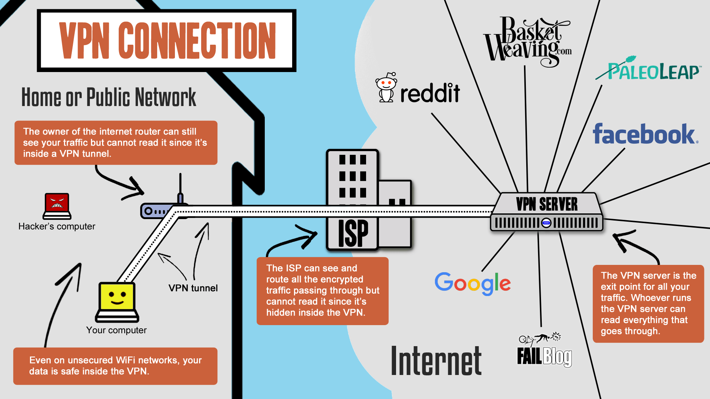

# VPNs

A **vpn** or **virtual private network** is a type of technology that allows remote computers to be securely connected over the internet as if they were connected locally.

There are two main types of VPNS we will consider.

## Host-to-network (or Remote Access)

This type of VPN allows a single computer to "dial in" to a remote network, after which the computer behaves exactly as if it were physcially connected to that network. This requires special software to be installed on both the remote computer AND the receiving network to establish the secure connection between them. Once the connection is established, ALL internet traffic from the computer will go through that connection, called a **tunnel**:star:

There are two main scenarios where VPNs are used.

### Using a VPN Service for Privacy and Geographic Restrictions

If you "have a VPN", you are likely using a VPN service whose purpose is to provide privacy and geographic mobility to your traffic. These companies will have servers all over the world and are often set up so that they keep no records or logs at all - all they do is forward your requests to the internet, then forward the response back to you over the secure tunnel.

{: style="width:80%;max-width:50rem;"}

## Site-to-site

This type of VPN allows to different networks to be connected as if they are one giant network. It works similarly, but individual computers do not need to have special software installed - the VPN connection is handled at the *router* level.

* Virtual private network
  * Can let you change virtual network locations
  * has its own IP address

* Single server