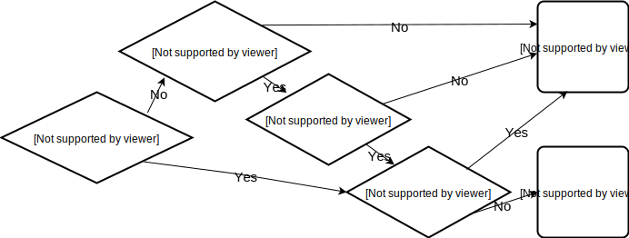

# The Standard Search Algorithms
There are a number of algorithms the IB course will assume you know by memory. These are the “standard algorithms”.

* Sequential search
* Binary search
* Bubble sort
* Selection sort

This notes page only discuss the first two - we will save sorting algorithms for a later unit.

## Sequential or Linear search

Search through a set of data *from the beginning to the end*, stopping as soon as you find the end.

### General pseudocode for the overall process

```
start by looking at the first position
loop until you are looking at the search value OR you looked at everything
    move on to the next value, keeping track of where you are
end loop
if you found the element in the loop, print the position
    otherwise, print "not found"
```


### IB Pseudocode with Arrays

The code below assumes you are searching an array called `ARR` for a value called `SEARCHVAL` and the length of the array is in `LENGTH`. This algorithm uses the standard `<` and `>` operators which will work with numbers; if you are asked to do this process with strings or something else you might need to use a method to compare values instead. It outputs the *index* of the first time the search value appears in the array.

```python
FOUND = false #this is called a *flag*
I = 0
loop while I < LENGTH and not FOUND
    if ARR[I] = SEARCHVAL then
        FOUND = true 
    else
        I = I + 1
    end if
end loop

if FOUND then
    output I
else
    output "Not found"
end if
```

### IB Pseudocode with collections

This code assumes we are searching a collection called `COL` for a search value called `SEARCHVAL`. It outputs the *first* position in the collection where the search value is contained, starting with position 0 (like an array).

```python
FOUND = false
I = 0
loop while COL.hasNext() and not FOUND
    if COL.getNext() = SEARCHVAL then
        FOUND = true
    else
        I = I + 1
    end if
end loop

if FOUND then
    output I
else
    output "Not Found"
end if
```

### Javascript code with arrays

Here is a method that is written in java - the array is called `haystack` and the search value is called `needle` (get it? needle in a haystack?). It returns the index of the *first* position where the search value is found, or `-1` if the object is not found, which is a pretty common system.

```java
public int sequentialSearch(String[] haystack, String needle) {
    for (int i=0; i < haystack.length; i++) {
        if (needle.equals(haystack[i])) {
            return i;
        }
    }
    return -1; //only ever get here if nothing was found
}
```

### Important theory about Sequential Search

A sequential search does NOT require your data to be sorted ahead of the search. This could save a lot of processing time. If, however, your data is already sorted, you can include within your sequential search a test to see if we have already gone past the point at which the record we are looking for *could* exist. In that case, we can abort the remainder of the search and return a “not found” result.

We say a sequential search is of "Order *N*", sometimes written O(N), because the amount of time it takes to run grows based on how big the array is: an array of size 10,000 will generally take about ten times as long as an array of size 1,000.

## Binary search

A binary search can be much more efficient than a sequential/linear search in the situation where your array is SORTED. It divides a range of values into halves, and continues to narrow down the field of search until the unknown value is found. It is the classic example of a “divide and conquer” algorithm.

### Pseudocode with Arrays

Just like the earlier sequential example, this code assumes an array called `ARR` with its length stored in `LENGTH` and a search value called `SEARCHVAL`. It will return the index of the search value (or *an* index if the search value is in there more than once, but not necessarily the first position). 

```python
FOUND = false
MINPOS = 0
MAXPOS = LENGTH - 1
loop while MINPOS <= MAXPOS and not FOUND
    MIDPOS = (MAXPOS + MINPOS) div 2 # integer division
    if ARR[MIDPOS] = SEARCHVAL then
        FOUND = true #the correct spot is in MIDPOS
    else if ARR[MIDPOS] > SEARCHVAL then
        # can ignore the top half now!
        MAXPOS = MIDPOS - 1
    else 
        # can ignore the bottom half now!
        MINPOS = MIDPOS + 1
    end if
end loop

if FOUND then
    output MIDPOS
else
    output "Not found"
end if
```

### java method version

```java
public int binary(double[] haystack, double needle) {
    int max = haystack.length-1;
    int min = 0;
    while (min <= max) {
        int mid = (min+max) / 2; //integer division
        if (haystack[mid] == needle) {
            return mid;
        } else if (haystack[mid] > needle) {
            max = mid - 1;
        } else {
            (haystack[mid] < needle) {
            min = mid + 1;
        }
    }
    return -1;
}
```


## Why choose one search over another?

The main advantage of a binary search is SPEED.  Consider an array with, say, 1 million elements. A sequential search will take, on average, hundreds of thousands of steps to find the search value. But the binary search, since it divides the problem by two each time, takes far fewer. After one step, you have eliminated 500,000 elements! If you keep dividing, you'll see it only takes a maximum of 20 steps to find an element. So much faster!

The DISADVANTAGE is that the array needs to be sorted for binary search to work. That is often not realistic, and even the best sorting algorithm is **much** slower than a sequential search. Because of that, it's usually only worth sorting an unsorted array *if* you are going to search it hundreds or thousands of times. A sequential search is also much easier to implement, and for small arrays will almost always be fast enough on modern computers.

So the decision tree for sequential vs binary looks like this:



Note that other data structures, specifically IB collections, can't use binary search at all! Since there is no way to "jump" to the middle of a collection, a linear search is the ONLY option for collections.

### Search algorithm exercises
1.  Tracing binary search

    Create a trace table on the binary search pseudocode algorithm above with the following values:

    ```
    ARR = [1, 2, 3, 5, 7, 11, 13, 17, 19, 23, 29, 31, 37]
    SEARCHVAL = 15
    ```
    You can use this first line to give you a start.

    | SEARCHVAL | FOUND | MAXPOS | MINPOS | MINPOS <= MAXPOS and not FOUND? | MIDPOS | ARR[MIDPOS] | Output |
    | --------- | ----- | ------ | ------ | ------------------------------- | ------ | ----------- | ------ |
    |           |       |        |        |                                 |        |             |        |

    <details markdown="1"><summary>Click to expand answer</summary>

    | SEARCHVAL | FOUND | MAXPOS | MINPOS | MINPOS <= MAXPOS and not FOUND? | MIDPOS | ARR[MIDPOS] | OUTPUT |
    | --------- | ----- | ------ | ------ | ------------------------------- | ------ | ----------- | ------ |
    | 15        |    false   | 13     | 0      | true                            | 6      | 13          |        |
    | 15        |    false   | 13     | 7      | true                            | 10     | 29          |        |
    | 15        |    false   | 9      | 7      | true                            | 8      | 19          |        |
    | 15        |    false   | 9      | 9      | true                            | 9      | 17          |        |
    | 15        |    false   | 8      | 9      | false                           |        |             | -1     |
    
    

    </details>

1.  Tracing binary search again!

    Create a trace table on the binary search pseudocode algorithm above with the following values:

    ```
    ARR = [1, 2, 3, 5, 7, 11, 13, 17, 19, 23, 29, 31, 37]
    SEARCHVAL = 5
    ```
    You can use this first line to give you a start.

    | SEARCHVAL | FOUND | MAXPOS | MINPOS | MINPOS <= MAXPOS and not FOUND? | MIDPOS | ARR[MIDPOS] | Output |
    | --------- | ----- | ------ | ------ | ------------------------------- | ------ | ----------- | ------ |
    |           |       |        |        |                                 |        |             |        |

    <details markdown="1"><summary>Click to expand answer</summary>

    | SEARCHVAL | FOUND | MAXPOS | MINPOS | MINPOS <= MAXPOS and not FOUND? | MIDPOS | ARR[MIDPOS] | OUTPUT |
    | --------- | ----- | ------ | ------ | ------------------------------- | ------ | ----------- | ------ |
    | 5        |    false   | 13     | 0      | true                            | 6      | 13          |        |
    | 5        |    false   | 5     | 0      | true                            | 2     | 3          |        |
    | 5        |    false   | 5      | 3      | true                            | 4      | 7          |        |
    | 5        |    false   | 3      | 3      | true                            | 3      | 5          |        |
    | 5        |    true   |   3    |    3   | false                           |     3   |             | 3     |
    
    

    </details>   

2. For each of the following scenarios, decide if a binary search would be worth the effort.
   1. You want to implement a spell checker that looks up words in a large dictionary of several hundred thousand words.
   2. You want to find the the highest score in an unsorted array of high scores.
   3. You have an array of Ball objects in a game in processing and want to search for the ball closest to the mouse
   
   <details markdown="1"><summary>Click to expand answer</summary>
   a) Yes! This is a perfect binary search scenario. b) nope. Not sorted, go sequential. c) Nope! Not sorted, go sequential.
   </details>