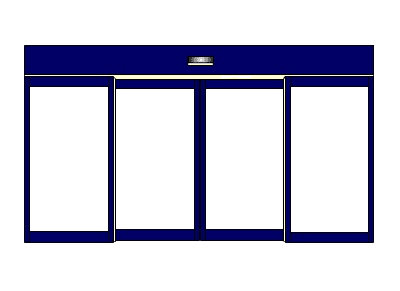
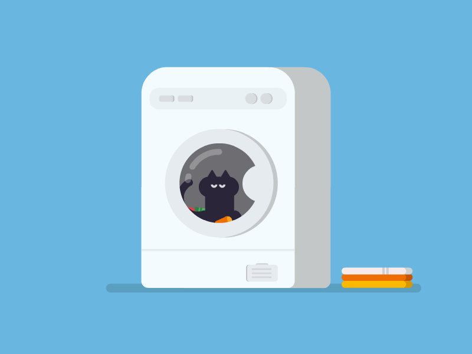

# Control Systems

IB Topic 7, control, concerns itself with one of the most common types of computerized systems in our life. A **control system** is a device, or set of connected devices, that manages, commands, directs, or regulates the behaviour of other devices (or systems!)

For the purpose of the IB exam, the term *control system* seems to be reserved for relatively simple, at least partially automatic devices that use **microprocessors**, **input sensors**, and **output transducers** to perform tasks.

## Examples of control systems

The IB syllabus states that we should have a reasonable understanding of the functionality of the control systems associated with the following devices:

* automatic doors
* heating systems
* taxi meters
* elevators
* washing machines
* process control
* device drivers
* domestic robots
* GPS systems
* traffic lights

## The three key components of an automatic control system

### Microprocessors / microcontrollers

The word **microprocessor** historically refers to any small integrated circuit that contains all the components necessary to function as the CPU (central processing unit, the main 'brain') of a computer. Every computer you have ever used contains a microprocessor. In modern terminolgy, however, the word microprocessor is often conflated with a **microcontroller**, which is specifically a small, relatively inexpensive, relatively simple integrated circuit that includes not only the CPU but also all of the other components needed for a simple computer application, such as RAM and input/output connectors. 

Microcontrollers are intended for **embedded systems** - situations where the computer is going to run a very simple program that is built and loaded onto the controller in advance, usually by the manufacturer. These are the chips that control things like your refrigerator, washing machine, air conditioner, even the charger brick for your phone! Simple ones can cost as little as $0.03 USD each, and you probably have several hundred of them in your house, if not more.

Each of the control systems we will examine over the course of this class will use at least one microcontroller.

### Sensors

Control systems always require inputs and outputs. Some of those inputs are human-directed, such as button presses or switches. Other inputs are automatic, based on factors in the real world. A **sensor** is a device that detects something in the real world and converts what it detects into an electrical signal that can be sent to a microprocessor.

Some common types of sensors include:

* light sensors
* pressure sensors
* temperature sensors
* audio sensors (a.k.a microphones!)
* ultrasonic sensors (used to detect distance to other objects)
* infrared sensors (detect warm objects a distance away)
  
### Output transducers

An **output transducer** is essentially a sensor in reverse - it receives an electrical signal from a microcontroller and converts it into something that can be perceived in the real world. 

Some common examples of output transducers are:

* motors (convert electricity to motion)
* lights / LEDs (convert electricity to light)
* speakers (convert electricity to sound)

## Example 1 - Automatic Doors

Consider an automatic door that opens whenever a human approaches the door, stays open as long as a human is passing through it, and closes once the coast is clear of humans. 

  
<small>Image credit: [Giphy](https://giphy.com/gifs/door-efgBNMkl9nNVS)</small>
{: .image-center}

1.  Where do you see something that will require a *sensor* in this description?

    

Click here to expand

    
    There will need to be at least one sensor that can detect a large object in front of the door - perhaps an infrared or ultrasonic sensor - as well as another one that can detect if a human is standing between the doors.

    

2.  Where is the *output transducer* in this description?

    

Click here to expand

    
    The output here is the motor or motors that cause the doors to open.
    
    

3.  Outline the algorithm the *microcontroller* might use in this situation.
   
    

Click here to expand

    
    For an "outline" question, like this one, the IB is looking for something in the style of a list. In this case, they are looking for a series of clear steps that mention the sensor, the output device, and the "thinking" that the microcontroller does to make the whole process works. Below is one example:

    *  Regularly poll the sensor to see if a human is there
    *  if a human is detected, send a signal to the output transducer connected to the motor to open the door
    *  Start polling the internal sensor
    *  Once the internal sensor shows no person (and a reasonable amount of time has passed), send another signal to the output transducer connected to the motor to close the door.
    *  Repeat... forever!
  
    

## Example 2 - Washing machines

Here are the basic steps of operating a washing machine.

  
<small>Image credit: [Petter Pentilä](https://dribbble.com/shots/5797861-How-to-Clean-Your-Cat-101)</small>
{: .image-right .image-small}

1. The user loads the clothes into the bin and the soap into the dispensor, selects a program by pressing a button, and presses the start button.
2. The washing machine fills the tub with water, up to a point specified by the program. Soap is dispensed from the soap dispensor as the water fills.
3. The clothes are allowed to soak for a time specified by the program.
4. An *agitator*, powered by a large motor, stirs the clothes around for a period of time and at a speed specified by the program.
5. The washer drains the water, using a pump to remove it from the machine.
6. The washer spins the clothes rapidly to remove as much water as possible, which is then pumped away again.
7. Finally it creates a sound to alert the user that the cycle is over.

Now that you know the basic steps followed by a washing machine, try to see if you can answer the question. 

This question is DIRECTLY from a previous exam (November 2019) and was worth 6 marks (out of 100, quite a lot!). Give it a try!

1. A washing machine uses a control system. The microprocessor controls the washing machine and its actions. To complete the wash and rinse process, the user selects the program, loads the washing machine, and pushes the start button. Describe the interaction between the sensors, microprocessors, and output transducers in this situation.

    

Click to see the OFFICIAL markscheme!

    There are many possible full-mark answers to this question: essentially they are looking for two *correct* mentions of sensors, two *correct* mentions of the processor, and two *correct* mentions of output transducers in order to get the full marks.

    **A full marks sample answer** (marking follows)

    * once the start button is pushed the washing machine begins to dump water into
    the drum, a sensor will detect that the water level has been reached;
    * based on the setting, the processor will allow the water to flow only to a
    predetermined level;
    * it will send the signal to output transducers to shut off the water;
    and begin the agitation process;
    * once the timer tells that it is time, processor sends signal to output transducer to
    stop agitating;
    * it then begins the spin process/ removing the dirty water from the machine
    * at the end of the spin cycle, the washing machine's processor sends signal
    to turn on the water pump and sucking it out of the machine;
    * it sends a signal to an output transducer to make a sound for the user to know the cycle is complete.

    **Marking Structure**

    *Award **[6 max]**.*  
    *Award [2 max] for evidence that:*  
    Sensors (input devices) detect/measure the water level;  
    sensors detect/measure the temperature (of the water);  
    sensors detect/measure the dampness/moisture level of the clothes;  
    sensors also detect movement of the machine's drum and other associated
    actions;  
    Sensors continuously take readings/measurements (in the context of above) and
    send these readings to the processor;

    *Award **[2 max]** for evidence that:*  
    processor controls sensors, valves and actuators responsible for controlling the
    parts that clean clothes;  
    processor determines what actions the machine should take next;  
    the washing machine has been programmed/ it goes through a process of
    running its internal programs;

    processor compares readings with pre-set values (in the context of the various
    sensors);  
    if the readings fall outside of the specified range, the processor sends a message
    to the output transducer to switch on/off ... (in the context of part of the washing
    machine);  

    *Award **[2 max]** for evidence that:*  
    output transducers are used for turning on and off devices that control the rest of
    the machine;  
    such as the motors that spin the tub;  
    or the water pump;

    
