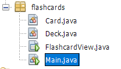
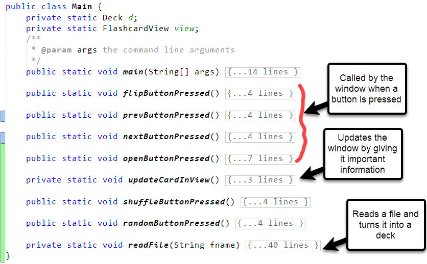
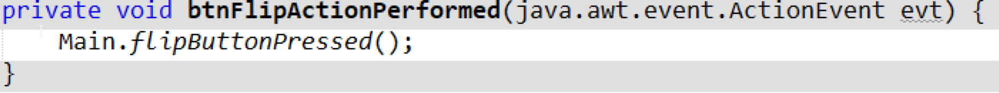
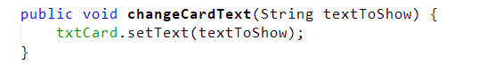
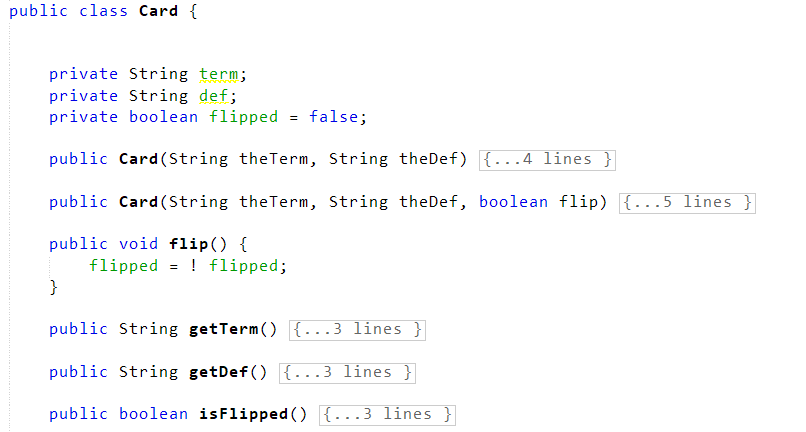
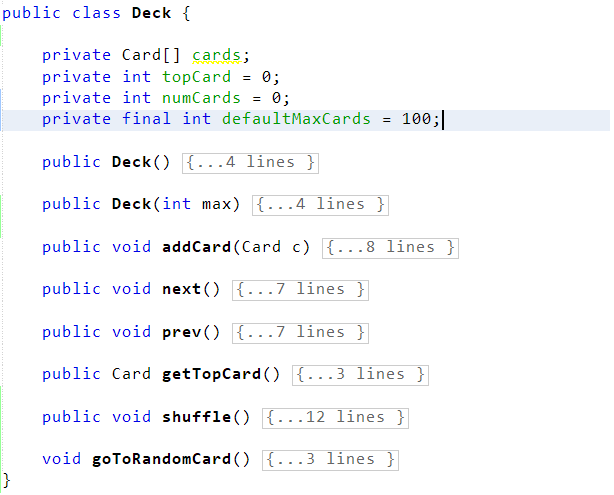
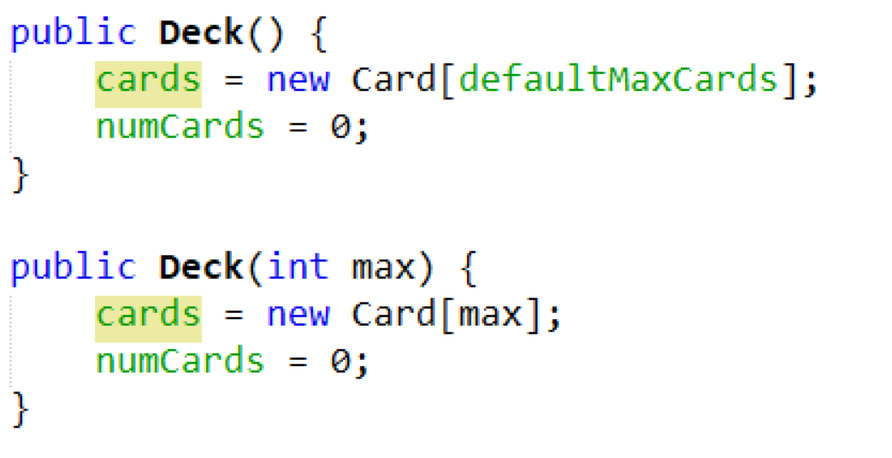

Here is a sample IA, based on a java flashcard app made in Netbeans with java. This is probably not going to earn a 7 as written, but it is a reasonable IA model for the structure of your report. In the final version, each criterion will be its own file, sometimes several files, but I am including them all in one place for ease of access in this sample.

Anything in <span class="instructions">small italics with a border</span> is NOT part of the IA itself, but is there as a note to you, the student.

# Table of Contents

<div class="instructions" markdown="1">
You do not need to include a Table of Contents like this in your IA, as it will be broken down into individual documents with a cover file I will help you make later. Some people DO include a table of contents in criterion C, but I think it's unneccesary. This is in this sample IA to help you navigate!
</div>

* TOC
{:toc}

**Total Word Count: 1856**

# Criterion A - Planning

## The Scenario

<div class="instructions" markdown="1">
This section should be about 150-250 words and should focus on the client, what they want, and why they want it. It should read clearly like you really talked to the client. It MUST include information about how they are currently dealing with this problem and why they find that solution unsatisfactory. It must also directly reference the interview with the client, referring to the appendix (where a transcript will be included).
</div>

My client is my teacher, Mr. Griswold. Mr. Griswold teaches computer science, and there are a lot of terms in that class. He likes to have students quiz themselves with digital flash cards, but has not found a digital solution that is simple and easy to use and works even when the internet isn't working. He wants to be able to distribute a simple downloadable program that will run on all computers for students to quiz themselves and each other in and out of class. In our interview (see transcript in appendix) he said he is "currently using quizlet.com", but it has several problems:

1. It's online only, with no offline component, "and the internet sometimes goes down here at school" (direct quote)
2. "Students can't comment on each other's decks" making it hard to give peer feedback
3. Finally, it has too many ads, games, and distractions. "It's too much" he says, and he wants something simpler.

*(158 words)*

## The Proposed Solution

<div class="instructions" markdown="1">
This section is another 150-250 words and should briefly describe the program you are planning to make and how it satisfies the needs of the client. Why is a computer application a reasonable solution to your client's problem and in what ways will it improve on their current system?

It must also justify WHY you are using the programming language and tools you are using, and why it makes sense.

It should NOT include a justification such as "we are learning this program in class" or "I am already familiar with this tool" - the justification should be based on the capabilities of the tools and the needs of the problem ONLY.
</div>

After conversations with Mr. G, I decided to make a simple java program with a basic UI to implement the flash cards. The java program will have a simple interface where students can import files that represent decks of flashcards, then cycle through the flashcards. Students will be able to share their decks as file using an already existing tool such as email, google drive, or google classroom. This will provide the essential features he needs without the extra distractions and account challenges caused by quizlet.

The reason I chose to use java is that it has easy tools to make simple interfaces that run perfectly on all desktop computers, Windows and Mac, which all of Mr. G's students have. Java also has good tools for opening and reading files, so it should be possible to import flashcard data from files. Java programs also do not need to be online to run. Java is also an object-oriented language and a tool like a flashcard tool has multiple objects that would be well-represented by that. Finally, I will be using the Netbeans IDE to simplify creation of a user interface, so I can concentrate on the code.

If I can get the minimal version of the program working, I can add features like a tool to make new flashcards and to leave comments for other people who open the deck.

*(229 words)*

## Success Criteria

<div class="instructions" markdown="1">
This section is a bulleted or numbered list of the success criteria. As long as the bullets are short, this does not count against your word count. The most important thing is that the criteria be detailed and TESTABLE, not generic. There should be between 8 and 15 of them.
</div>

1. You can load decks from a file saved on the computer
2. Flashcard deck files should be editable by humans
3. Once loaded, the first flashcard in the deck should appear.
4. One button can flip the flashcard from front to back
5. Another button can move forward or backward in the deck
6. The deck can be shuffled to change the order
7. It should work well and look similar on Macs and PCs
8. The term should be in a larger font than the definition for readability

****

# Criterion B - Design

## Record of Tasks

<div class="instructions" markdown="1" style="margin-bottom: 1rem">
This table is provided by the IB directly, and this exact format MUST be used to keep track of the tasks associated with the planning, designing, developing, testing, and implementing your solution. (I know the format is a little clunky, but you CANNOT CHANGE IT). The template will be provided for you on Google Classroom. Note that this doesn't include information about the **writing**, only the actual doing the project. 

The "Criterion" selection should NOT use the letters A-E and instead should use the words "Plan", "Design", "Develop", "Test", and "Implement"
</div>

  

| Task Number | Planned Action                                      | Planned Outcome                                                                                  | Time Estimated    | Target Completion Date | Criterion         |
| ----------- | --------------------------------------------------- | ------------------------------------------------------------------------------------------------ | ----------------- | ---------------------- | ----------------- |
| 1           | Find a client                                       | Client Found - Mr. G!                                                                            | 2 months          | November 25 2019       | Plan              |
| 2           | Get approval from Mr. G (CS Teacher)                | Project approved                                                                                 | 10 minute meeting | January 25 2020        | Plan              |
| 3           | Initial meeting with client                         | Understand project goals and success criteria                                                    | 30 minutes        | Februrary 25 2020      | Plan/Design       |
| 4           | Brainstorm project design and UI                    | Initial Wireframe diagrams for the user interface, some flowcharts, and UML diagrams for classes | 2 days            | March 1-2 2020         | Design            |
| 5           | Implement classes for cards and decks               | Functioning classes that allow me to make cards and decks (not displayed yet)                    | 2 days            | March 4-6 2020         | Develop           |
| 6           | Test classes                                        | Fake decks and cards print out correctly                                                         | 1 hour            | March 6 202            | Testing           |
| 7           | Implement UI to let me flip and move through decks  | Basic working program, without the file loading working yet                                      | 2 days            | March 9-11 2020        | Develop / Testing |
| 8           | Design file structure for card decks                | Have some sample files that can be used to represent decks and shared online                     | 1 day             | March 12 2020          | Design            |
| 9           | Add file loading to program in UI                   | Program can load decks from sample files                                                         | 2 days            | March 13-14 2020       | Develop / Testing |
| 10           | Add shuffle feature                                 | Can now shuffle decks                                                                            | 1 day             | March 15               | Develop           |
| 11          | Meet with client to show prototype and get feedback | Client suggests making the UI more symmetric and adding the "random order" checkbox              | 45 minutes        | March 31               | Testing           |
| 12          | Implement client requests                           | Make UI prettier and added and implemented random order checkbox                                 | 2 days            | April 8-10 2020        | Develop       |
| 13          | Test product with client                            | Most or all success criteria met and client understands how to use the project                   | 1 hour            | April 16 2020          | Testing                 |
| 14          | Client tries out product with one class             | Client was able to use the product and see if it worked well for his needs.                      | 1 hour            | April 20, 2020         | Implement                 |

## Design Overview

<div class="instructions" markdown="1">
This section needs to provide a detailed look at your design process, but ideally will not use ANY of your word count to do so. That means it should be limited to headers, short bulleted lists, and lots and lots of diagrams. Some examples of things you can include: wireframe diagrams and screenshots of prototype UIs (for user interface design), flow charts, pseudocode, or other diagrams you used to help you plan out the flow of your code, diagrams such as UML diagrams that help you think about how your code will be organized. Weirdly, you are told you should NOT include screenshots of the final program here, since that is technically not part of design, but screenshots that are later changed are fine!
</div>

### UI Design

#### Wireframe of basic UI

* Made early in project.
* Added shuffle checkbox later, after realizing it was missing.

<div class="instructions" markdown="1">
This was made using [wireframe.cc](http://www.wireframe.cc), a very simple UI mockup site.
</div>

{:width="500px"}

#### Early UI Prototype

* Screenshot from Netbeans March 9 2020. Early prototype only.

{:width="500px"}

### Program Organization

* Follows the model-view-controller design process.
  * Use the Main class for the model, a FlashcardView class for view, and Deck and Card classes for the Model

#### UML Class Diagrams

<div class="instructions" markdown="1">
This was made using [LucidChart](http://www.lucidchart.com) by importing the UML shapes library.
</div>


### Program Flow flowchart

<div class="instructions" markdown="1">
This was also made with LucidChart
</div>


### Design for files that represent cards

* Easiest to read in one line at a time in java
* Term one line, then definition
* Blank line after definition (this allows for multiple-line definitions)

#### sample deck file

```
abstraction
The process of simplifying complicated ideas to the minimum we need to know to be able to use them.
Examples of abstraction include a map, which is an abstraction of the geography of the real world.

hardware
The physical parts of a computer
Examples include hard disks, CPUs, and RAM

Types of memory
Primary - RAM, ROM, Cache, CPU Registers
Secondary - Hard disks, cd roms, floppy drives, flash drives, etc.
```

## Test Plan

<div class="instructions" markdown="1">
The *Test Plan* is considered part of the Design, but is really its own thing. It should follow a format similar to the one below, where you clearly express *exactly* how you will test each success criterion. You can use more than one row for success criteria that should be tested multiple ways.
</div>

| Success Criterion | Test Action | Expected Result |
| ------------------|-------------|-----------------|
| 1. You can load decks from a file saved on the computer | Save the sample deck file above on the computer and try loading it in | No errors, first card "abstraction" appears |
| 1. You can load decks from a file saved on the computer | Load a file that is incorrectly formatted or blank | No crashes, but nothing happens or clear pop-up error appears |
| 2. Flashcard deck files can be edited by humans | Ask a friend to look at the deck file and add a new terms then try loading it | Friend is able to add a new term correctly with no support, file loads correctly |
| 3. Once loaded, the first flashcard in the deck should appear | Already tested above | See above |
| 4. One button can flip the flashcard from front to back | Press flip button on first card in deck above several times and observe | The card should switch between the two sides correctly |
| 5. Another button can more forward or backward in the deck | Press the next and previous buttons and observe. Cards should change based on the buttons, preserving the order in the file. |
| 6. The deck can be shuffled to change the order | Press the shuffle button on a sample deck and run through | Order should be different |
| 7. It should work well and look similar on Macs and PCs | Test on my personal PC and a friend's mac and confirm it looks similar |
| 8. The term should be in a larger font that the definition for readability | Load any deck and observe | Term in larger font |

***

# Criterion C - Development

<div class="instructions" markdown = "1">
This part of the IA is worth the most marks. From this section, plus part D, the moderator will first evaluate your projects **complexity** and **ingenuity**. We will discuss this more later. Each is scored on a Low / Medium / High scale, and the combination determines the range of marks you can get: for example, High / High will earn between 10 and 12 marks, while Low / Low will earn between 1 and 4. Other combinations have ranges in the middle, and the writing determines where you fall in the range.

The section is the longest part, between 500-1200 words of extended writing with screenshots. (as long as your total for the entire IA is under 2000!) The primary goal is to demonstrate your algorithmic thinking and explain how you developed the product, while pointing out interesting techniques you used (and that you understand them!). You should not include screenshots of all of the code here, only illustrative bits that illustrate the narrative of your development process and show off your ingenuity and the complexity of the product.

You should organize this section by *technique* or *concept*, when possible.

This section will likely include references to external sources where you learn coding techniques or information that explains what you are doing. Cite those sources and include a works cited at the end.
</div>

## Imports and Dependencies

This program does not depend on anything outside of the standard java utility library and the Swing GUI library - no other libraries or dependencies were imported.

## Techniques Used

* Model / View / Controller project design
* Object Oriented Programming, including encapsulation
* Static and non-static methods
* Overloading constructors for extensibility
* Working with arrays  (algorithmic thinking)
* File input (algorithmic thinking)

## Model / View / Controller project design

The project consists of four java class files, shown below.

{:width="300px"}

The image below (Hernandez) explains the role of the three components of the MVC architecture.

{:width="600px"}

In my program, the `Main.java` file defines the controller of my program, the `Card.java` and `Deck.java` files define the model of my program, and the `FlashcardView.java` file defines the view of my program. In the next few sections I will explain how these components connect to one another.

### The controller

`Main.java` (shown below) includes most of the "thinking" of the program. 

{:width="100%"}

It starts by defining static variables that refer to the currently loaded deck and the main view window. It initializes those values and updates them based on the actions in the view. The **static** methods named after button presses (starting with `flipButtonPressed`) are called whenever a button is pressed and update the model appropriately, then the method `updateCardInView` is used to pass the information back to the window for updating the display. 

The methods in `Main.java` need to be **static** because Main is not an object that is ever created with the `new` command.

### The View

The "View" part of my program, `FlashCardView.java` was mostly created by the Netbeans Java GUI builder, but whenever a button is pressed it calls a method in Main (the controller) to handle the press, as seen below.

{:width="500px"}

I also added a method to allow the card text to be updated, shown below.

{:width="500px"}

The final GUI looked like this when implemented:

{:width="500px"}

### The Model

The `Deck.java` and `Card.java` classes contain the *model* of my data. 

A card consists of three instance variables: `String term`, `String def`, and `String flipped` and accessors are provided for all three, as well as a public method `flip()` that allows the controller to mark a card as flipped over.



The `Deck` class consists of an array of `Cards` with a default maximum size of 100 cards, a variable to keep track of which card is on top, and a series of methods that allow the controller to add cards to the deck, see the top card, and move around the deck.



## Object-Oriented Programming (Encapsulation)

In the classes pictured above, you can see that, for example, the variable `numCards` in the `Deck` class is private, and there is no **mutator** to let the controller manipulate it directly. This is an example of *encapsulation*, where some values in a class are kept private (freecodecamp.org) so that no other class can mess with the state except through the allowed methods (in this case by adding a new card).

## Static and Non-static methods

Static methods are used in situations where a method needs to be called without actually creating an object. In my `Main` class above, all of the methods are static because `Main` is never created as an object. In my `Deck` class, however, all methods are non-static because they only refer to a specific `Deck` that has been explicitly created.

## Overloading Constructors for extensibility

In both `Card` and `Deck` I provided multiple constructors for different scenarios. In `Deck`, the two constructors are shown below:

{:width="300px"}

The first constructor assumes a default max deck side of 100 cards, but the second constructor allows me to make the deck have a larger (or smaller) maximum deck size if deisred. I don't currently use that feature in my code, but this allows for the possibility of extension later.

## Working with arrays (algorithmic thinking)

I chose to use an array of `Card` objects to represent a deck of cards, which required some careful thinking. The first thing I considered is that arrays are a fixed size in java, so I needed to make a large empty deck when initializing a deck (as seen in the constructors above) but also keep track of how many cards I had actually added. That's what the `numCards` variable is measuring, so whenever a card is added it is incremented.

I also needed to make sure that I didn't go over the length of the deck, so I added a check in the `addCard` method to print an error on the console if that happened.

{:width="300px"}

I also realized eventually that I needed to make sure the `prev()` and `next()` options looped back around if they hit the end, since card decks never really end!

{:width="300px"}

I also needed to add the ability to shuffle the deck, so I looked up "how to shuffle an array" on the internet. I found lots of options, but decided to go with the simplest one  (the citation is in the code below)

{:width="400px"}

## File Input

The most challenging part of this project was figuring out how to open and read the file. Reading files in java is complicated! I tried lots of things and looked at lots of tutorials before I realized I could use the `Files.readAllLines()` method to get a list of strings broken up by lines. I then googled "iterating through lists" and learned about the really cool `Iterator` object, which looks a lot like IB Collections!

{:width="600px"}

After some thinking (and designing!) I figured out how I wanted to save my files that represent decks, then I tried to figure out how to read it. That took a while, and I made some mistakes, but I got there! The screenshot below shows part of the if statement that ended up solving the problem. This was complex algorithmic thinking!

{:width="600px"}

*(1002 words)*

## Works Cited

* Hernandez, Rafael D. “The Model View Controller Pattern – MVC Architecture and Frameworks Explained.” FreeCodeCamp.org, <em>FreeCodeCamp.org</em>, 20 Apr. 2021, <a href="https://www.freecodecamp.org/news/the-model-view-controller-pattern-mvc-architecture-and-frameworks-explained/">www.freecodecamp.org/news/the-model-view-controller-pattern-mvc-architecture-and-frameworks-explained/</a>

* freeCodeCamp.org. “How to Explain Object-Oriented Programming Concepts to a 6-Year-Old.” <em>FreeCodeCamp.org, freeCodeCamp.org,</em> 27 June 2018, <a href="https://www.freecodecamp.org/news/object-oriented-programming-concepts-21bb035f7260/">www.freecodecamp.org/news/object-oriented-programming-concepts-21bb035f7260/</a>

* “Java Iterator.” <em>W3 Schools</em>, <a href="http://www.w3schools.com/java/java_iterator.asp">http://www.w3schools.com/java/java_iterator.asp</a>

----

# Criterion D - Functionality

<div class="instructions" markdown="1">
There is nothing written in criterion D. You hand in a 3 -7 minute video (NO LONGER!) showing you using the product and walking the viewer through all of the success criteria. The goal is for the viewer to understand everything your product can do, and be shown in what ways it was successful. The last 30 seconds can be spent discussing ways you could expand or improve it. It will NOT show lots of data entry in the video - if your product involves entering lots of data, don't record that part, it is boring! This video should also not look at the code at ALL - ONLY the functioning product!

In criterion D, you are also assessed on extensibility. This mostly means things like: did you provide your source code? Was it well-formmated, with helpful comments? Are variable names understandable? Basically, could other coders use it and is there room in the code organization to make it better? This doesn't need to be shown in the video, it will be accessed through the code in criterion C and the design plan.
</div>

<video width="800" controls>
    <source src="media/vid.mp4" type="video/mp4">
</video>

***

# Criterion E - Evaluation and Reflection

## Evaluation of the product

<div class="instructions" markdown="1">
This section should refer back to the success criteria from criterion A, feedback from the client/advisor, and other appropraite feedback. 175-250 words.
</div>

My product satisfied most of the success criteria we established in criterion A.
1. You can load decks from a file saved on the computer
   ***Satisfied! The "open" button works***
2. Flashcard deck files should be editable by humans - ***Partially Satisfied*** - Mr. Griswold thinks the flashcard format is pretty good, but he thinks it could be more flexible (see interview 2 in appendix), and is worried that students will forget the blank line between words, for example. 
3. Once loaded, the first flashcard in the deck should appear. -***Satisfied***
4. One button can flip the flashcard from front to back - ***Satisfied***
5. Another button can move forward or backward in the deck -***Satisfied***
6. The deck can be shuffled to change the order - ***Satisfied***
7. It should work well and look similar on Macs and PCs - ***Partially Satisfied*** - the Mac version works fine, but the GUI is not well-centered. I don't know how to fix this, unfortunately. It is also possible that file formats could cause a problem though we haven't had that bug yet.
8. The term should be in a larger font than the definition for readability - ***Not Satisfied** Even though I think I could do this, I ran out of time and decided it wasn't that important. Mr. Griswold agreed.

Mr. Griswold is happy with my product and is planning to use it in class for reviewing for the IB exam - he has already made some card decks he intends to share with students. You can see his specific comments about the product in the Appendix (interview transcript 2). Overall, even though one success criteria were not satisfied, the product does what it should do.

*(286 words)*

## Suggestion for future improvements

<div class="instructions" markdown="1">
In this final section, the user should mention 2-3 suggestions for improvement of the product. These should be *realistic* but also *meaningful* - don't suggest simple things like "make it more colorful" and also don't suggest really huge things you would have no idea how to start like "implement the ability to download files off of Google Drive". The secret to a good suggestion for improvement is to find the middle ground.

These can and should include feedback from the client as well.
</div>

1. A user interface for creating decks. Currently to create decks students need to edit a text file, which is possible but also opens up room for error. A good extension would be to allow students to add, edit, and save flashcards using the GUI tool itself. I think this would be manageable, but would requiire significant effort to add the new buttons and figure out how to output a file in the correct format. Mr. Griswold suggested this after seeing the flashcard format and using it with students, as some of them were reluctant to make decks using a text editor.

2. Ability to study multiple decks at once. Currently the user can only load one deck at at time, but it might be nice to be able to load more than one deck at a time and shuffle randomly between them - this could be useful when studying for a test with multiple parts, for example. One of Mr. Griswold's students suggested this, saying that studying with a small deck isn't always useful.

*(175 words)*