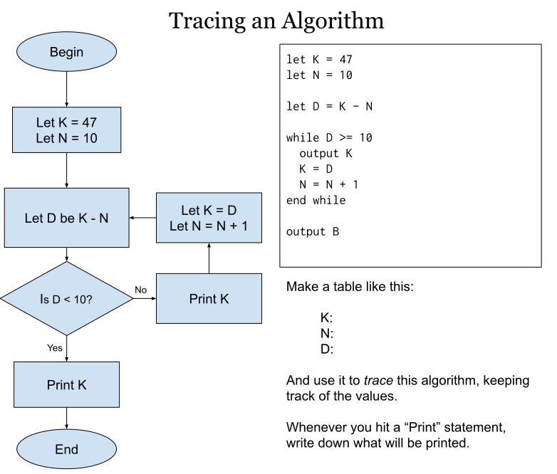

# All Algorithms We have Traced This year

As we trace and construct new algorithms in class, I will add them to this page as reference, with solutions.

When you are constructing an algorithm in pseudocode, it may help to use [this pseudocode simulator](http://ibcomp.fis.edu/pseudocode/pcode.html) made by IB CS teacher Dave Mulkey. It allows you to actually run pseudocode and see if it works!

## Unit 1

### First algorithm ever!

This was done on August 6 in HL, August 7 in SL

#### Algorithm

{: style="max-width:600px"}

#### Solution

<details markdown="1"><summary>Click to expand answer</summary>
```none
K:  47  37  26  14
N:  10  11  12  13
D:  37  26  14  1

Output: 47  37  26  14
```
</details>

### Algorithm 2

This was done on August 8 in HL, August 9 in SL

#### Algorithm

{: style="max-width:600px"}

#### Solution

<details markdown="1"><summary>Click to expand answer</summary>
```none
Run 1
T: 42 31 20 9
F: 11
Output: 9

Run 2
T: 19 9
F: 10
Output: 9

Run 3
T: 25 20 15 10 5 0
F: 5
Output: 0

The output is the REMAINDER when T is divided by F.
```
</details>

### Algorithm 3

This was done on August 12 in HL, August 13 in SL. This comes directly from the May 2018 SL Paper.

#### Prior Knowledge Needed

You need to know that `A mod B` means "The remainder when A is divided by B". So the value of `11 mod 3` is `2`, because 11/3 is 3 with a remainder of 2.

You also need to know that `A div B` means to do division but drop the decimal part (not round, just ignore it!) So the value of `11 div 3` is 3.

#### Algorithm

{: style="max-width:600px"}

#### Solution

<details markdown="1"><summary>Click to expand answer</summary>
```none
K: 47 23 11
N: 10 10 10

Output: 47 23 11
```
</details>

### Algorithm 4

Trace for N = 6 and N = 7

#### Algorithm

```none
SUM = 0
loop COUNT from 1 to (N div 2)
    if N mod COUNT = 0 then
        SUM = SUM + COUNT
    end if
end loop
if SUM = N then
    output "perfect"
else
    output "not perfect"
end if
```

#### Solution


<details markdown="1"><summary>Click to expand answer</summary>
```none
SUM:    0   1    3    6
COUNT:    1    2    3
N:      6

Output: "perfect"


SUM:    0   1    1    1
COUNT:    1    2    3
N:      7

Output: "not perfect"
```
</details>

### Algorithm 4

Introducing arrays!

#### Algorithm

Trace the algorithm below for `STOCKS = [42, 11, 6, 3]`

```none
COUNT = 0
TOTAL = 0

loop N from 0 to STOCKS.length - 1
    if STOCKS[N] ≠ 0 then
        COUNT = COUNT + 1
        TOTAL = TOTAL + STOCK[N]
    end if
end loop

if COUNT ≠ 0 then
    AVERAGE = TOTAL / COUNT
    output "Average = ", AVERAGE
else
    output "There are no non-zero values"
end if
```

#### Solution

<details markdown="1"><summary>Click to expand answer</summary>
```none
STOCKS = [42, 11, 6, 3]

N:      0   1   2   3
COUNT:  1   2   3   4
TOTAL: 0  42  53  59  62
AVERAGE:                 15.5

output: "Average = 15.5"
```
</details>

### Algorithm 5

Construct code that would accept an array of strings named FIRST and an array of strings named LAST (you can assume they are the same length) and loop through both of them, outputting the joined names in LAST, FIRST format.

#### Some possible solutions

##### Pseudocode

<details markdown="1"><summary>Click to expand answer</summary>
```
loop N from 0 to FIRST.length - 1
    output LAST[N], ", ", FIRST[N]
end loop
```
</details>

##### Typescript

```ts
for (let i = 0; i < FIRST.length; i++) {
  output(LAST[i] + ", " + FIRST[i]);
}
```
{:.spoiler}

### Algorithm 6

Collections!

#### Algorithm

Trace the algorithm below for a collection NAMES with the values {David, Jake, Ross, David, Jim}

```none
// Assume LIST is an array with plenty of room, but currently empty

COUNT = 0 // number of names currently added to array LIST
loop while NAMES.hasNext() 
    DATA = NAMES.getNext()

    FOUND = false
    loop POS from 0 to COUNT - 1
        if DATA = LIST[POS] then
            FOUND = TRUE
        end if
    end loop

    if FOUND = false then
        LIST[COUNT] = DATA
        COUNT = COUNT + 1
    end if
end loop

output LIST
```

#### Solution

<details markdown="1"><summary>Click to expand answer</summary>
```
LIST:   []          [David]        [David, Jake]     [David,Jake,Ross]    //same    [David,Jake,Ross,Jim]
COUNT:  0              1               2               3                  //same
DATA:      David            Jake                Ross                    David           Jim
FOUND:       f                 f   f             f f                      t t t       f f f f f
POS:                             0              0 1                      0 1 2         0 1 2 3

output: [David, Jake, Ross, Jim]

This algorithm moves items from a list to an array, ignoring duplicate values
```
</details>

### Algorithm 7

Imagine you have an array called SCORES that represents all the scores a player has earned on a video game (all positive numbers). The array is NOT sorted. Construct an algorithm that finds the highest score and outputs the sentence "Your high score is: ____" (with the correct high score in the blank). NOTE: You should NOT initialize SCORES in your algorithm - you should assume it exists before your algorithm starts.

#### Solution

<details markdown="1"><summary>Click to expand answer</summary>
```none
HIGH=0
loop i from 0 to SCORES.length
  if SCORES[i]>HIGH then
    HIGH=SCORES[i]
  end if
end loop
output "Your high score is " + HIGH

# to test your own code, add the line SCORES = [1, 44, 2, 4] above your algorithm
# in the simulator linked at top, and look for output "Your high score is 44".
```
</details>

### Algorithm 8

Construct an algorithm identical to the one for algorithm 7, but using an IB Collection called SCORES rather than an array.

#### Solution

<details markdown="1"><summary>Click to expand answer</summary>
```none
SCORES.resetNext()
HIGH = 0
loop while SCORES.hasNext()
  A = SCORES.getNext()
  if A > HIGH then
    HIGH = A
  end if
end loop
output "Your high score is " + HIGH

# To test your own code, add the lines below before your algorithm in the simulator:
#  SCORES = new Collection()
#  SCORES.addItem(1)
#  SCORES.addItem(44)
#  SCORES.addItem(3)

# If your code runs correctly, the output will be "Your high score is 44".
```
</details>


### Algorithm 9

Predict the output of the code below. The `firstLetter` function returns the first letter of a string.

#### Algorithm

```none
NAMES = new Collection()

NAMES.addItem("Bob")
NAMES.addItem("Dave")
NAMES.addItem("Betty")
NAMES.addItem("Kim")
NAMES.addItem("Debbie")
NAMES.addItem("Lucy")

NAMES.resetNext()

loop while NAMES.hasNext()
    NAME = NAMES.getNext()
    if firstLetter(NAME) = "D" then
      output NAME
    end if
end loop
```

#### Solution

<details markdown="1"><summary>Click to expand answer</summary>
```
Dave
Debbie
```
</details>

### Algorithm 10

Imagine you have an IB collection called NAMES. Construct an algorithm that will take the collection and output a single sentence in the form `The names are: {Bob Mary Joe Dave }`

#### Solution

<details markdown="1"><summary>Click to expand answer</summary>
```none
OUT = "The names are: {"
NAMES.resetNext()
loop while NAMES.hasNext()
  OUT = OUT + NAMES.getNext() + " "
end loop
OUT = OUT + "}"
output OUT

# You can check your answer by copying the NAMES setup information from Algorithm 9
# into the pseudocode simulator then adding your algorithm underneath
# but remember, if your pseudocode isn't perfect you can still get full credit
```
</details>

### Algorithm 11

This one comes from [FIS's list of old algorithms](http://ibcomp.fis.edu/275979/ibcomp/review/TSM2006PcodeAlgs.pdf)

The following algorithm fragment has been designed to analyse the temperatures at a tourist
resort.

```none
COUNT = 0
TOTAL = 0
TEMP = input("Enter a temperature")
BIG = TEMP
loop while not(TEMP = 0)
  TOTAL = TOTAL + TEMP
  COUNT = COUNT + 1
  input TEMP
  if TEMP > BIG then
    BIG = TEMP
  endif
end loop
AVERAGE = TOTAL / COUNT
output AVERAGE, BIG
```

Copy, add lines, and complete the trace table below, assuming the user enters the data **15, 7, 23, 9, 0**

| Count | Total | Temp | Big | not (TEMP = 0) | output |
| ----- | ----- | ---- | --- | -------------- | ------ |
| 0     | 0     | 15   |     |                |        |
|       |       |      |     |                |        |

### Algorithm 12

Consider the fragment of code below:

```none
X = 1
loop while X < 6
    Y = 1
    loop while Y < 5
        Y = Y + 1
    end loop
    output “The product of X and Y is ”, X * Y
    output “The values of X and Y are ”, X, Y
    X = X + 1
end loop
```

Write down the complete output of this algorithm (no full trace required)

### Algorithm 13

Consider the fragment of code below:

```none
X = 1
loop while X < 6
    Y = 1
    loop while Y < 6
        output “The product of X and Y is ”, X * Y
        Y <-- Y + 2
    end loop
    output “The values of X and Y are ”, X, Y
    X = X + 2
end loop
```

Write down the complete output of this algorithm (no full trace required)