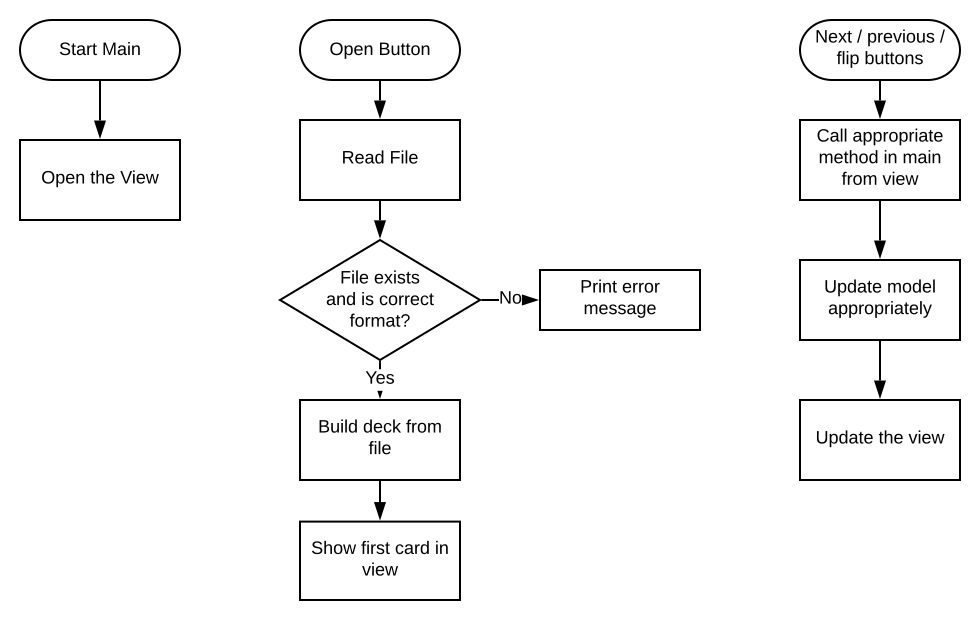
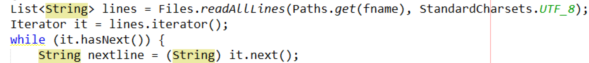

Here is a sample IA, based on the java flashcard app we are building together in class. This is not going to earn a 7 as written, but it is a reasonable IA model for the structure of your report. In the final version, each criterion will be its own file, sometimes several files, but I am including them all in one place for ease of access in this sample.

# Criterion A - Planning

## Deliverable 1 - The Scenario

<small><i>This section should be about 175-250 words and should focus on the client, what they want, and why they want it. It should read clearly like you really talked to the client. My word count is 179 words.</i></small>

My client is my teacher, Mr. Griswold. Mr. Griswold teaches computer science, and there are a lot of terms in that class. He likes to have students quiz themselves with digital flash cards, but has not found a digital solution that is simple and easy to use and works even when the internet isn't working. He wants to be able to distribute a simple downloadable program that will run on all computers for students to quiz themselves and each other in and out of class. During the interview (see transcript in appendix) he showed me his current solution, the website quizlet, but mentioned several things he did not like about that site:

1. The tool is on the web with no offline component, so if the internet isn't working it doesn't work at all
2. There is no way for teachers or other students to leave comments or feedback on card decks shared with them by others
3. He finds the many different games, ads, and options on the site to be distracting and would prefer something more simple

## Deliverable 2 - The Proposed Solution

<small><i>This section is another 175-200 words and should briefly describe the program you are planning to make and how it satisfies the needs of the client. It must also justify WHY you are using the programming language and tools you are using, and why it makes sense. My section below is 200 words.</i></small>

After conversations with Mr. G, I decided to make a simple java program with a basic UI to implement the flash cards. The java program will have a simple interface where students can import files that represent decks of flashcards, then cycle through the flashcards. Students will be able to share their decks as file using an already existing tool such as email, google drive, or google classroom.

The reason I chose to use java is that it has easy tools to make simple interfaces that run perfectly on all desktop computers, Windows and Mac, and since Mr. G teaches computer science his students will all be able to run java programs. Java also has good tools for opening and reading files, so it should be possible to import flashcard data from files. Java programs also do not need to be online to run. Java is also an object-oriented language and a tool like a flashcard tool has multiple objects that would be well-represented by that.

If I can get the minimal version of the program working, I can add features like a tool to make new flashcards and to leave comments for other people who open the deck.

## Deliverable 3 - Success Criteria

<small><i>This section is a bulleted or numbered list of the success criteria. As long as the bullets are short, this does not count against your word count. The most important thing is that the criteria be detailed and TESTABLE, not generic.</i></small>

### Functional Requirements

1. Files that represent flash card decks can be loaded from the interface
2. Flash card definitions and words can be flipped easily
3. It is possible to move forward and backward in the deck
4. The deck can be shuffled to change the order
5. Flash card files are easily created and shared by students to each other

### Non-functional requirements

1. It should work well and look similar on Macs and PCs
2. The term should be in a larger font than the definition

### Optional extension features

1. Students can choose to go in a complete random order
2. Cards can be marked "learned" which will make them get skipped most of the time
3. Multiple decks can be loaded at once to make a "super" deck
4. A separate interface that creates decks

# Criterion B - Design

## Deliverable 4 - Record of Tasks

<small>
*This table is provided by the IB directly, and this exact format MUST be used to keep track of the tasks associated with the planning, designing, developing, testing, and implementing your solution. (I know the format is a little clunky, but you CANNOT CHANGE IT). [Click here to make a copy of the template in your own google drive](https://docs.google.com/document/d/1oHUq_0TDtJoxTZXafWsQppiAJcPBMRzWUZ8gEwDmuUM/copy). Note that this doesn't include information about the **writing**, only the actual doing the project. One confusing thing is that there is no place to record the actual outcome, only the planned outcome. Nor is there any place to record whether the target completion date was met. Nonetheless, we follow the template! Even though this is listed as a "planning" document it is expected that you will fill it out as you go, so if you miss a target date the next date will be adjusted to handle that.*
</small>

| Task Number | Planned Action                                      | Planned Outcome                                                                     | Time Estimated    | Target Completion Date | Criterion |
| ----------- | --------------------------------------------------- | ----------------------------------------------------------------------------------- | ----------------- | ---------------------- | --------- |
| 1           | Find a client                                       | Client Found - Mr. G!                                                               | 2 months          | November 25 2019       | A         |
| 2           | Get approval from Mr. G (CS Teacher)                | Project approved                                                                    | 10 minute meeting | January 25 2020        | A         |
| 3           | Initial meeting with client                         | Understand project goals and success criteria                                       | 30 minutes        | Februrary 25 2020      | A         |
| 4           | Brainstorm project design and UI                    | Initial Wireframe diagrams for the user interface, flowcharts, and UML diagrams     | 2 days            | March 1-2 2020         | B         |
| 5           | Implement classes for cards and decks               | Functioning classes that allow me to make cards and decks (not displayed yet)       | 2 days            | March 4-6 2020         | C         |
| 6           | Implement UI to let me flip and move through decks  | Basic working program, without the file loading working yet                         | 2 days            | March 9-11 2020        | C         |
| 7           | Design file structure for card decks                | Have some sample files that can be used to represent decks and shared online        | 1 day             | March 12 2020          | B         |
| 8           | Add file loading to program in UI                   | Program can load decks from sample files                                            | 2 days            | March 13-14 2020       | C         |
| 9           | Add shuffle feature                                 | Can now shuffle decks                                                               | 1 day             | March 15               | C         |
| 10          | Meet with client to show prototype and get feedback | Client suggests making the UI more symmetric and adding the "random order" checkbox | 45 minutes        | March 31               | E         |
| 11          | Implement client requests                           | Make UI prettier and added and implemented random order checkbox                    | 2 days            | April 8-10 2020        | C         |
| 11          | Test product with client                            | Most or all success criteria met and client understands how to use the project      | 1 hour            | April 16 2020          | D         |
| 12          | Client tries out product with one class             | Client was able to use the product and see if it worked well for his needs.         | 1 hour            | April 20, 2020         | E         |

## Deliverable 5 - Design Overview

*This section needs to provide a detailed look at your design process, but ideally will not use ANY of your word count to do so. That means it should be limited to headers, short bulleted lists, and lots and lots of diagrams. Some examples of things you can include: wireframe diagrams and screenshots of prototype UIs (for user interface design), flow charts, pseudocode, or other diagrams you used to help you plan out the flow of your code, diagrams such as UML diagrams that help you think about how your code will be organized. Weirdly, you are told you should NOT include screenshots of the final program here, since that is technically not part of design, but screenshots that are later changed are fine!*

### UI Design

#### Wireframe of basic UI

* Made early in project.
* Added shuffle checkbox later, after realizing it was missing.

<small>*This was made using [wireframe.cc](http://www.wireframe.cc), a very simple UI mockup site.*</small>

{:width="500px"}

#### Early UI Prototype

* Screenshot from Netbeans March 9 2020. Early prototype only.

{:width="500px"}

### Program Organization

* Follows the model-view-controller design process.

#### UML Class Diagrams

<small>*This was made using [LucidChart](http://www.lucidchart.com) by importing the UML shapes library.*</small>


### Program Flow flowchart

<small>*This was also made with LucidChart*</small>



### Design for files that represent cards

* Easiest to read in one line at a time in java
* Term one line, then definition
* Blank line after definition (this allows for multiple-line definitions)

#### sample deck file

```
abstraction
The process of simplifying complicated ideas to the minimum we need to know to be able to use them.

hardware
The physical parts of a computer
Examples include hard disks, CPUs, and RAM

Types of memory
Primary - RAM, ROM, Cache, CPU Registers
Secondary - Hard disks, cd roms, floppy drives, flash drives, etc.
```

## Test Plan

To test my product, I will create several sample flashcard decks, and load them all on my computer and test all of the buttons to make sure they do what they are supposed to do (flip, next, previous, shuffle/random if implemented). I will also try loading some files that aren't made right and see how my program handles that, since we don't want it crashing! I will also package the file as a program and send it to a friend who has a Mac so I can test it on his computer as well. Finally I will have my client try to use it with a whole class of students and see if it works.

# Criterion C - Development

<small>
*This part of the IA is worth the most marks. From this section, plus part D, the moderator will first evaluate your projects **complexity** and **ingenuity**. We will discuss this more later. Each is scored on a Low / Medium / High scale, and the combination determines the range of marks you can get: for example, High / High will earn between 10 and 12 marks, while Low / Low will earn between 1 and 4. Other combinations have ranges in the middle, and the writing determines where you fall in the range.*
</small>

<small>
*The section is the longest part, between 500-1000 words of extended writing with screenshots. The primary goal is to demonstrate your algorithmic thinking and explain how you developed the product, while pointing out interesting techniques you used. You should not include screenshots of all of the code here, only illustrative bits that illustrate the narrative of your development process and show off your ingenuity and the complexity of the product.*
</small>

## Techniques Used

* Object Oriented Programming, including encapsulation (see 'Model' section)
* Overloading constructors for extensibility (in Deck, see 'Model' section)
* Carefully chosen data structures (array in Deck, see 'Model' section)
* Model / View / Controller design
* File input (see 'Controller' section)
* Algorithmic thinking - complex conditional statement for reading files ('Controller' section)
* Static and non-static methods

## The Model

After planning out my classes as shown in my UML diagram, I knew that I should start with the simplest classes. So the first thing I built was the Card class. It is a very simple class with three instance variables, accessors for all three, and the ability to change one (`flipped`). I was proud of how efficiently I coded the `flip()` method in one line:

{:width="300px"}

Next I built the `Deck` class. This one was harder. I decided to keep the cards in the deck as an array, but I knew java arrays are fixed length, so I decided to default to a maximum of 100 cards in the deck. I decided to go ahead and provide a constructor where the user could specify the maximum size, though, in case that ever makes sense in the future, even though I don't use that feature now.

{:width="300px"}

I needed to make sure that I didn't go over the length of the deck, so I added a check in the `addCard` method to print an error on the screen if that happened.

{:width="300px"}

I also realized eventually that I needed to make sure the `prev()` and `next()` options looped back around if they hit the end, since card decks never really end!

{:width="300px"}

I also needed to add the ability to shuffle the deck, so I looked up "how to shuffle an array" on the internet. I found lots of options, but decided to go with the simplest one. I had to modify the algorithm to work with my Card objects.

{:width="400px"}

## The View

Next I built my `Flashcardview` file. I used the GUI builder to build the actual GUI, shown below in its final form.

{:width="500px"}

The GUI builder automatically generated most of the code. When I started thinking about how my code would work, I had my first realization that if I wanted the code that *controls* my code to be in `Main` (my controller!) I would need to make static methods in Main to run when I pressed buttons. So I used Netbeans to configure all of the button presses to call static functions in Main, as shown.

{:width="500px"}

Then I went to `Main.java` to implement all of these classes! Most of that was straightforward. I had to make a method called `updateCardInView()` that read the top card from the deck and printed it in the model, which made me need to write a mutator called `changeCardText()` in the View.

The only really challenging part was figuring out how to open and read the file. Reading files in java is complicated! I tried lots of things and looked at lots of tutorials before I realized I could use the `Files.readAllLines()` method to get a list of strings broken up by lines. I then googled "iterating through lists" and learned about the really cool `Iterator` object, which looks a lot like IB Collections!

{:width="600px"}

After some thinking (and designing!) I figured out how I wanted to save my files that represent decks, then I tried to figure out how to read it. That took a while, and I made some mistakes, but I got there! The screenshot below shows part of the if statement that ended up solving the problem. This was complex algorithmic thinking!

{:width="600px"}

# Criterion D - Functionality

*There is nothing written in criterion D. You hand in a 4-7 minute video (NO LONGER!) showing you using the product and walking the viewer through all of the success criteria. The goal is for the viewer to understand everything your product can do, and be shown in what ways it was successful. The last 30 seconds can be spent discussing ways you could expand or improve it. It will NOT show lots of data entry in the video - if your product involves entering lots of data, don't record that part, it is boring!*

*In criterion D, you are also assessed on extensibility. This mostly means things like: did you provide your source code? Was it well-formmated, with helpful comments? Are variable names understandable? Basically, could other coders use it and is there room in the code organization to make it better?*

*My video below has terrible audio. Sorry, I made this at 1:15 a.m. and didn't want to plug in my better microphone, so the computer's fan is very loud in it.*

<video width="800" controls>
    <source src="media/vid.mp4" type="video/mp4">
</video>

# Criterion E - Evaluation and Reflection

## Evaluation of the product

*This section should refer back to the success criteria from criterion A, feedback from the client/advisor, and other appropraite feedback. 175-250 words.*

My product satisfied most of the success criteria we established in criterion A.

### Functional Requirements

1. Files that represent flash card decks can be loaded from the interface - ***Satisfied! The "open" button works***
2. Flash card definitions and words can be flipped easily - ***Satisfied!***
3. It is possible to move forward and backward in the deck - ***Satisfied!***
4. The deck can be shuffled to change the order -  ***Satisfied!***
5. Flash card files are easily created and shared by students to each other  
   ***Partially Satisfied*** - Mr. Griswold thinks the flashcard format is pretty good, but he thinks it could be more flexible, and is worried that students will forget the blank line between words, for example. 

### Non-functional requirements

1. It should work well and look similar on Macs and PCs  
   ***Partially Satisfied*** - the Mac version works fine, but the GUI is not well-centered. I don't know how to fix this, unfortunately.

2. The term should be in a larger font than the definition  
   ***Not satisfied*** - Even though I think I could do this, I ran out of time and decided it wasn't that important. Mr. Griswold agreed.

### Optional extension features

1. Students can choose to go in a complete random order  
   ***Satisfied!*** - both the shuffle and random feature allow this.
2. Cards can be marked "learned" which will make them get skipped most of the time
   ***Not satisfied*** - I did not implement this feature
3. Multiple decks can be loaded at once to make a "super" deck
   ***Not satisfied*** - this could easily be done by adding an "add to deck" button that doesn't clear the deck before reading
4. A separate interface that creates decks
   ***Not satisfied***

Mr. Griswold is happy with my product and is planning to use it in class for reviewing for the IB exam - he has already made some card decks he intends to share with students. Overall, even though a couple of success criteria were not satisfied, the product does what it should do!

## Suggestion for future improvements

Most of the optional extension requirments mentioned in the previous section would make good improvements in the future, especially the additional interface for creating flash cards, which would allow students to create decks without needing to edit the files themselves. Having completed this project, I think that project would be manageable and maybe I will find the time to do it soon! I also think it would be nice if cards could have formatted text, or the ability to have comments. That would definitely require the building interface, though, since it would be too hard to write a file with those features by hand. The product could also be improved interface-wise; it would be nice if there were an animation when the card is flipped to make it look more real.