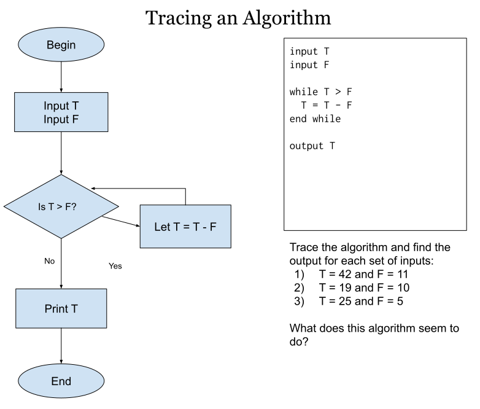
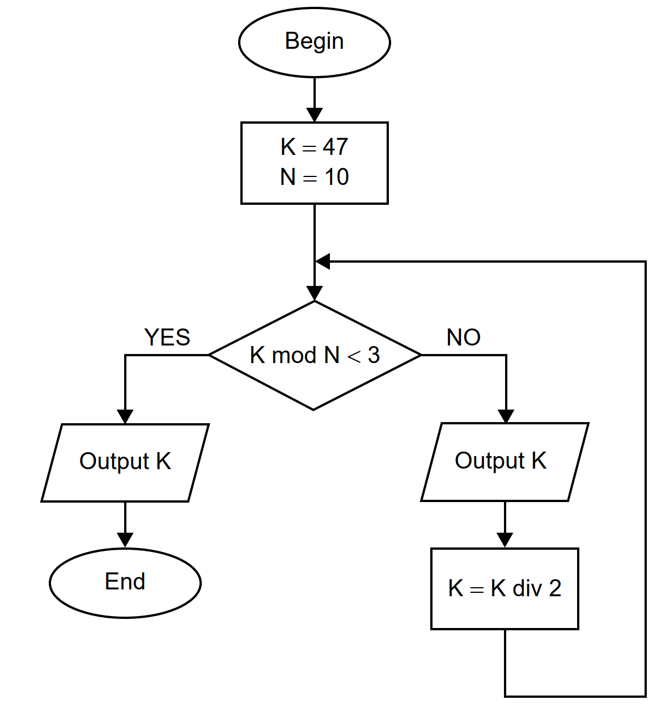

# All Algorithms We have Traced This year

As we trace new algorithms in class, I will add them to this page as reference, with solutions.

## Unit 1

### First algorithm ever!

This was done on August 6 in HL, August 7 in SL

#### Algorithm

{: style="max-width:600px"}

#### Solution

Hover or tap the region below to see the solution.

```
K:  47  37  26  14
N:  10  11  12  13
D:  37  26  14  1

Output: 47  37  26  14
```
{: .spoiler}

### Algorithm 2

This was done on August 8 in HL, August 9 in SL

#### Algorithm

{: style="max-width:600px"}

#### Solution

Hover or tap the region below to see the solution.

```
Run 1
T: 42 31 20 9
F: 11
Output: 9

Run 2
T: 19 9
F: 10
Output: 9

Run 3
T: 25 20 15 10 5 0
F: 5
Output: 0

The output is the REMAINDER when T is divided by F.
```
{: .spoiler}

### Algorithm 3

This was done on August 12 in HL, August 13 in SL. This comes directly from the May 2018 SL Paper.

#### Prior Knowledge Needed

You need to know that `A mod B` means "The remainder when A is divided by B". So the value of `11 mod 3` is `2`, because 11/3 is 3 with a remainder of 2.

You also need to know that `A div B` means to do division but drop the decimal part (not round, just ignore it!) So the value of `11 div 3` is 3.

#### Algorithm

{: style="max-width:600px"}

#### Solution

Hover or tap the region below to see the solution.

```
K: 47 23 11
N: 10 10 10

Output: 47 23 11
```
{: .spoiler}

### Algorithm 4

Trace for N = 6 and N = 7

#### Algorithm

```
SUM = 0
loop COUNT from 1 to (N div 2)
    if N mod COUNT = 0 then
        SUM = SUM + COUNT
    end if
end loop
if SUM = N then
    output "perfect"
else
    output "not perfect"
end if
```

#### Solution

Hover or tap the region below to see the solution.

```
SUM:    0   1    3    6
COUNT:    1    2    3
N:      6

Output: "perfect"


SUM:    0   1    1    1
COUNT:    1    2    3
N:      7

Output: "not perfect"
```
{: .spoiler}

### Algorithm 4

Introducing arrays!

#### Algorithm

Trace the algorithm below for `STOCKS = [42, 11, 6, 3]`

```
COUNT = 0
TOTAL = 0

loop N from 0 to STOCKS.length - 1
    if STOCKS[N] ≠ 0 then
        COUNT = COUNT + 1
        TOTAL = TOTAL + STOCK[N]
    end if
end loop

if COUNT ≠ 0 then
    AVERAGE = TOTAL / COUNT
    output "Average = ", AVERAGE
else
    output "There are no non-zero values"
end if
```

#### Solution

```
STOCKS = [42, 11, 6, 3]

N:      0   1   2   3
COUNT:  1   2   3   4
TOTAL: 0  42  53  59  62
AVERAGE:                 15.5

output: "Average = 15.5"
```
{: .spoiler}

### Algorithm 5

Construct code that would accept an array of strings named FIRST and an array of strings named LAST (you can assume they are the same length) and loop through both of them, outputting the joined names in LAST, FIRST format.

#### Some possible solutions

##### Pseudocode

```
loop N from 0 to FIRST.length - 1
    output LAST[N], ", ", FIRST[N]
end loop
```
{: .spoiler}

##### Typescript

```ts
for (let i = 0; i < FIRST.length; i++) {
  output(LAST[i] + ", " + FIRST[i]);
}
```
{:.spoiler}

### Algorithm 6

Collections!

#### Algorithm

Trace the algorithm below for a collection NAMES with the values {David, Jake, Ross, David, Jim}

```
// Assume LIST is an array with plenty of room, but currently empty

COUNT = 0 // number of names currently added to array LIST
loop while NAMES.hasNext() 
    DATA = NAMES.getNext()

    FOUND = false
    loop POS from 0 to COUNT - 1
        if DATA = LIST[POS] then
            FOUND = TRUE
        end if
    end loop

    if FOUND = false then
        LIST[COUNT] = DATA
        COUNT = COUNT + 1
    end if
end loop

output LIST
```

#### Solution

```
LIST:   []          [David]        [David, Jake]     [David,Jake,Ross]    //same    [David,Jake,Ross,Jim]
COUNT:  0              1               2               3                  //same
DATA:      David            Jake                Ross                    David           Jim
FOUND:       f                 f   f             f f                      t t t       f f f f f
POS:                             0              0 1                      0 1 2         0 1 2 3

output: [David, Jake, Ross, Jim]

This algorithm moves items from a list to an array, ignoring duplicate values
```
{: .spoiler}