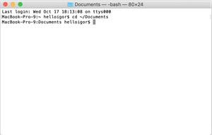
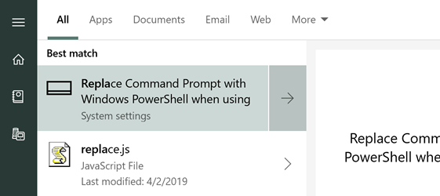

# In the beginning was the command line

Professional computer people spend a lot of time staring at words (or at least letters and numbers), even the ones that make graphical things. They do this in two places: their *text editors* or *IDEs* (integrated development environment - more on those later) and the *command line*. A command line is a typing-based interface to your computer that lets you perform operations like move files and run software without needing to click things. They feel very alien at first, but once you get used to them they are awesome!

(P.S. If you're really interested in computer history, the title of this section is also the title of a free short book you can find online with a lot of computer history in it. It's very out of date now, but still fun!)

## Let's get into our command line.

The instructions below will both *explain things* and tell you *to do things*. If you see a checkbox, that means we want you to DO something. You can check them off as you go! If you do not see a checkbox, you are not being asked to do anything.

### Mac Users

  
<small>*(image credit:* [MacPaw](https://macpaw.com/how-to/use-terminal-on-mac))</small>
{: .image-right}

You need to open the `Terminal` app.
- [ ] Type `⌘ Command`+`Space` to open your search menu, type `terminal`, then open the app. 
- [ ] Add this app to the dock by right-clicking it's icon in the dock, choosing "Options" then "Keep in Dock"

<small>Mac users can now jump to [Basic Commands](#some-basic-commands)</small>
{: .clearfix}

### Windows Users

Windows actually has TWO built-in command lines - one is called simply `Command Prompt` or `cmd` and the other is called `Powershell`. Powershell is much more powerful, and since you are learning this for the first time you should definitely use it! 

- [ ]  Press the start button and just *start* typing `Replace Command Prompt With Windows Powershell when using Windows+X Menu`. The option with that name should appear pretty quickly, and you can click it. 
{: height=150 align=center}

- [ ]  In the window that appears, scroll down until you see the option. Toggle it ON, if it's not already, as seen below.  
{: height=50 align=center}

- [ ] Now, you should be able to press `⊞ Windows`+`X` on your keyboard OR right-click on the start menu to get your power menu. When it comes up, choose the option `Windows Powershell`  
{: height=70 align=center}

You should now have your command prompt open! You can pin this to the taskbar if you wish, for easy access later.  
{: align=center}

## Some basic commands

Not every command line is the same. On Macs, the command line is powered by a program called `bash`. On Windows, it is `Powershell`.  They are very different in a lot of ways, but luckily there are some commands that will work similarly on the two systems. Let's practice some! Each of these commands should be followed by presing `Enter` or `Return` to run the command. 

In each line, you will need to READ about the command first (without doing anything!) then follow the specific instructions below each line.

* **`ls`** will **l**i**s**t the files in the directory (folder) you are currently in. 
  - [ ] Type `ls` and press enter to see a list of files. (on Windows, typing `dir` will do the same thing if you like that better)
  
* **`pwd`** will **p**rint the **w**orking **d**irectory - it tells you what folder you are in! 
  - [ ] type `pwd` and press enter, then see what happens. You should be in your main user folder. Most command lines give you the output of `pwd` right on the command line without typing.
  
* **`cd ~`** **c**hanges **d**irectories to your home (~) folder
  - [ ] If you type this command now, it's quite possible nothing will happen! You should already be in your home, or user, folder. Just in case you aren't, type `cd ~` and press enter.
  
* **`mkdir`*`name`*** will make a directory, or folder. 
  - [ ] We want to make a directory to hold our code for this course. For simplicity, let's make it right here in your user folder. Type `mkdir ibcs` to make a folder called "ibcs" in the current directory (we can always move this later if you want)
  
* **`cd`*`name`*** changes to a directory with the name you enter
  - [ ] Type `cd ibcs` to move into your new folder. **Hint:** if you press `Tab` after you type `cd ib` it should *autocomplete* the rest of the directory. Tabbing is the best!
  
* **`touch`*`name`*** will create a new (empty) text file. 
  - [ ] Type `touch test_file` then type `ls` to see that you created the file!
  
* **`cp`*`oldfile newfile`*** will copy a file from one place to another. 
  - [ ] Type `cp test_file test2`, then type `ls` to see your new copied file.
  
* **`mv`*`oldfile newfile`*** will rename (or rename + move) a new file 
  - [ ] To rename, type the original name then the new one. Type `mv test_file test1` to change its name. Type `ls` to confirm it worked.

* **`mv`*`oldfile newfolder`*** will move a folder to a new directory/folder, but keep the name.
  - [ ] Make a new directory with `mkdir lesson01`, then type `mv test* lesson01`. The `*` tells the commandline to include *everything* that starts with test, so BOTH files should get moved. Confirm it using `cd lesson01` followed by `ls`.
  
* **`open`*`file_or_folder`*** (Mac) or **`ii`*`file_or_folder`*** (Windows) opens the file or folder just like you double-clicked it.
  - [ ] Type `open .` or `ii .` to open the current folder in the Finder / Explorer (the `.` is a shortcut that means "current folder")
  - [ ] This should have opened a file browser in the `lesson01` folder. Do you see your test files? Go ahead and close it now, we don't need that window.
  - [ ] Type `cd ..` to move up to the previous folder (the `..` is the shortcut for "parent folder"). You should be back in the `ibcs` folder - use `pwd` to confirm that if you're not sure.

Congratulations! You can now do some basic things in the command line. Welcome to hackerhood.                                                           
## Study Materials

{: .image-right}
You should probably make flash cards for these commands eventually, as they are very useful, especially `ls`, `mv`, `cp`, `cd`, `pwd` and `touch`

----

[Return to Getting Set Up](01_Getting_Set_Up.md)