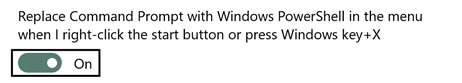
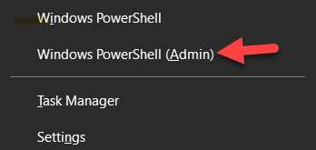

# It all started with the command line.
Professional computer people spend a lot of time staring at words (or at least letters and numbers), even the ones that make graphical things. They do this in two places: their *text editors* or *IDEs* (integrated development environment - more on those later) and the *command line*. A command line is a typing-based interface to your computer that lets you perform operations like move files and run software without needing to click things. They feel very alien at first, but once you get used to them they are awesome!

(P.S. If you're really interested in computer history, the title of this section is also the title of a free short book you can find online with a lot of computer history in it. It's fun!)

## Let's get into our command line.
### Mac Users 
You need to open the `Terminal` app. You can find this in your Applications / Utilities folder or by typing `⌘ Command`+`Space` and then typing `terminal`. Go ahead and add it to the dock, we'll be using it a lot! <small>*(image credit:* https://macpaw.com/how-to/use-terminal-on-mac)</small>

### Windows Users
Windows actually has TWO commandlines - one is called simply `Command Prompt` or `cmd` and the other is called `Powershell`. The best way to get powershell running is with the "Power Users Menu", which comes up when you RIGHT-click on the start button or type `⊞ Windows`+`X` on your keyboard. To enable this, follow these steps:
* press the start button and start typing `Replace Command Prompt With Windows Powershell when using Windows+X Menu` until the option appears as shown below. Click it when it does. 
   
* In the window that appears, scroll down until you see the option. Toggle it ON, as seen below.
   
* Now, you should be able to press `⊞ Windows`+`X` on your keyboard OR right-click on the start menu to get your power menu. When it comes up, choose the option `Windows Powershell (admin)`
    
* You should now have your command prompt open!
   

## Some basic commands

Not every command line is the same. On Macs, the command line is powered by a program called `bash`. On Windows, it is `Powershell`. They are very different in a lot of ways, but luckily there are some commands that will work similarly on the two systems. Let's practice some! Each of these commands should be followed by presing `Enter` or `Return` to run the command. 

Read about the commands below and follow the instructions!

* **`ls`** will **l**i**s**t the files in the directory (folder) you are currently in. 
  * Type `ls` and press enter to see a list of files. (on Windows, typing `dir` will do the same thing)
* **`pwd`** will **p**rint the **w**orking **d**irecotry - it tells you what folder you are in! 
  * type `pwd` and see what happens. You should be in your main user folder. Most command lines give you the output of `pwd` right on the command line without typing.
* **`cd ~`** **c**hanges **d**irectories to your home (~) folder
  * You should be in your home, or user, folder. Just in case you aren't, type `cd ~`. The `~` symbol (usually in the upper-left of your keyboard, and you need to use `Shift`) is a shortcut for "home directory" so this will take you to your home folder if you aren't there.
* **`mkdir `*`name`*** will make a directory, or folder. 
  * We want to make a directory to hold our code for this course. For simplicity, let's make it right here in your user folder. Type `mkdir ibcs` to make a folder called "ibcs" in the current directory (we can always move this later if you want)
* **`cd `*`name`*** changes to a directory with the name you enter
  * Type `cd ibcs` to move into your new folder. **Hint:** if you press `Tab` after you type `cd ib` it should *autocomplete* the rest of the directory. Tabbing is the best!
* **`touch`*`name`*** will create a new (empty) text file. 
  * Type `touch test_file` then type `ls` to see that you created the file!
* **`cp`*`oldfile newfile`*** will copy a file from one place to another. 
  * Type `cp test_file test2`, then type `ls` to see your new copied file.
* **`mv`*`oldfile newfile`*** will rename (or rename + move) a new file 
  * To rename, type the original name then the new one. Type `mv test_file test1` to change its name. Type `ls` to confirm it worked.
* **`mv`*`oldfile newfolder`*** will move a folder to a new directory/folder, but keep the name.
  * Make a new directory with `mkdir lesson01`, then type `mv test* lesson01`. The `*` tells the comandline to include *everything* that starts with test, so BOTH files should get moved. Confirm it using `cd lesson01` and `ls`.
* **`open`*`file_or_folder`*** (Mac) or **`ii`*`file_or_folder`*** (Windows) opens the file or folder just like you double-clicked it.
  * Type `open .` or `ii .` to open the current folder in the Finder / Explorer (the `.` is a shortcut that means "current folder")
  * You should be inside your `lesson01` folder. Are you? Do you see your test files? Go ahead and close it
  * Type `cd ..` to move up to the previous folder (the `..` is the shortcut for "parent folder")

Congratulations! You can now do some basic things in the command line. Welcome to hackerhood.