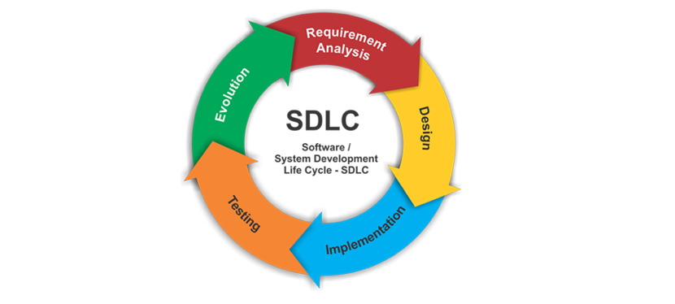

# Introduction to Systems Design - Requirements Analysis

These notes are taken almost verbatim from Paul Baumgarten's page [here](https://pbaumgarten.com/ib-compsci/unit-1/). I have made only a few changes.

## System development life cycle

At university level for a Computer Science course, the design cycle for software is known as the SDLC: System development life cycle (some books substitute "system" with "software").

The major sections of the SDLC are:

* Requirements analysis
* Design
* Implementation
* Testing
* Evolution

We will examine each section for what needs to occur. ON this page, we will be focusing on Requirements Analysis.

---

## SDLC Phase 1: Requirements analysis

Aim of phase 1: Figure out what the project needs to accomplish.

There are typically 4 elements to this:

* Project scoping
* Stakeholder consultation
* Project research
* Requirements planning

---

### Project scoping

> Find out exactly what it is you have to do

A **scope document** allows all parties to agree in writing as to what *is* and *is not* included within the project. It effectively becomes the contract, and establishes common expectations for client and creator.

* Happy customer = good word of mouth.
* Disgruntled customer (feels ripped off or that you didn't deliver on what was promised) = bad for business.
* Burnt out producer (feeling taken advantage of, frustrated at changing requirements) = Not healthy!

Scoping should be SMART

* **S**pecific
* **M**easurable
* **A**greed upon
* **R**ealistic
* **Time** bound

Ensure your scopes identify time, financial and resource constraints!

It is inevitable that a project scope will change over time. Make sure that your scope doesn't get more vague over time - if it changes, it should change in a way that makes it more clear and specific!

### Stakeholder consultation

Identifying stakeholders

* Who is relevant? Employers, employees, customers…?
* Who will use the system?
* Who will depend on the system (even if they don't use it directly)?
* Who will provide information the system depends on? (even if they don't enter it directly)
* Who is paying for the system? (why?)

Possible strategies for obtaining requirements from stakeholders

* Surveys
* Interviews
* Direct observations
* Document collection

Failure to involve all relevant stakeholders may lead to software that is not suitable for its intended use! (The manager doesn't necessarily always know what the clerical staff do!)

Effective collaboration and communication between all parties: client, developer, end users.

Consultation should occur continually throughout the lifecycle to identify problems early.

Be aware of privacy issues – being able to get honest, frank information from a stakeholder without fear of retribution (eg: a staff member who might have valuable insight into how some part of the system doesn't work the way management thinks it does) – create an environment where you can extract those valuable nuggets

### Project research

* Examine the **current system** that yours will replace – strengths, weaknesses, idiosyncrasies.
* Examine **competing products** – strengths, weaknesses, idiosyncrasies.
* Examine **your capabilities** – what are you capable of producing? if you need additional expertise, what can you afford to recruit?
* Examine the **literature** (journals, online forums) – how are other people addressing the problem?

When researching your project, don't forget to account for international factors.

* Does your program only have to work for a homogeneous group of people in the same location? Or might you have to deal with different timezones, different languages, different conventions in date formats? Things can get very complex very quickly as these videos demonstrate.

* The Problem with Time & Timezones - Computerphile  
  [https://www.youtube.com/watch?v=-5wpm-gesOY](https://www.youtube.com/watch?v=-5wpm-gesOY)

* Internationalis(z)ing Code - Computerphile  
  [https://www.youtube.com/watch?v=0j74jcxSunY](https://www.youtube.com/watch?v=0j74jcxSunY)

---

### Requirements planning

Your requirements are generally split into functional and non-functional requirements.

* Functional: What will the program actually do? For example:
  * Store hours worked per employee per day
  * Store hourly rates for employees by category of employment
  * Store daily timesheets for up to 5 years history
  * Calculate income tax obligiations per employee at the end of each month
    
* Non-functional: Doesn't affect what the program will actually do, but will impact on creating it anyway. For example:
  * The system shall run on Android / iOS / the web.
  * The system shall be compatible with Microsoft SQL / Google Firebase
  * The system shall share data with (insert other existing product here)
  * The system shall be operational in 3 months
  * The system shall store it's data within Switzerland (due to privacy laws)

### Exercise

Split off into pairs - one taking the role of customer, one taking the role of developer. Customer comes up with an app/software project they want the developer to "design". Developer must ask questions to ascertain:
 * A scope document: Explicitly list "in scope" and "out of scope" items
 * Identify stakeholders
 * Requirement specification: Functional and non-functional items

Reverse roles when ready.

Save these project outlines as we will continue to use them.

## Your IA

You will go through these steps with your client as part of the first step of your IA. 
